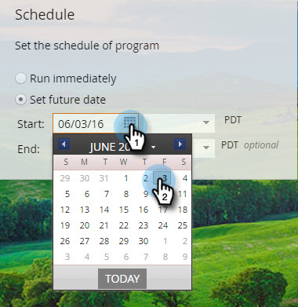

# 计划应用程序内消息{#schedule-your-in-app-message}

立即发送您的消息或将其计划以后。

1. 要计划应用程序内消息，请选择&#x200B;**设置将来日期**&#x200B;并从下拉日历中选择开始日期。

   

1. 从下拉菜单中选择开始时间。

   

1. 结束日期和时间是可选的；从下拉菜单中选择它们。

   

1. 或者，要立即运行项目，请选择&#x200B;**立即运行**。 “开始日期”字段将消失。

   

放轻松！ 最后但不是最不重要的是[Approval](/help/marketo/product-docs/mobile-marketing/in-app-messages/sending-your-in-app-message/approve-your-in-app-message.md)步骤。
