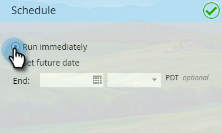

# 计划应用程序内消息 {#schedule-your-in-app-message}

立即发送您的消息或安排以后发送。

1. 要计划应用程序内消息，请选择 **设置未来日期** 并从下拉日历中选择开始日期。

   

1. 从下拉菜单中选择开始时间。

   

1. 结束日期和时间是可选的；从下拉菜单中选择它们。

   

1. 或者，要立即运行程序，请选择 **立即运行**. 开始日期字段消失。

   

放松！ 最后，但最不重要的是 [批准](/help/marketo/product-docs/mobile-marketing/in-app-messages/sending-your-in-app-message/approve-your-in-app-message.md) 中。
