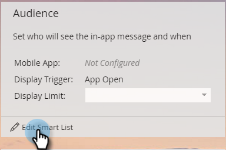

# 设置应用程序内消息受众 {#set-your-in-app-message-audience}

第一步是决定应该接收应用程序内消息的人员。 您需要设置智能列表。

1. 单击 **编辑智能列表**.

   

1. 在智能列表中，会自动填充具有移动设备应用程序活动触发器。 单击下拉列表，然后选择要将消息放入其中的应用程序。

   

   >[!NOTE]
   >
   >应用程序内消息程序当前不支持“移动设备应用程序”字段的多个值。

1. **应用程序打开** 是默认的操作设置，但您可以选择已设置的任何自定义事件。

   

   >[!NOTE]
   >
   >默认触发器（应用程序打开）和开发人员添加到代码的任何自定义触发器会自动显示在操作选择器中。 如果缺少自定义事件，请与开发人员核实，确保他们已将自定义事件添加到应用程序。 请注意，自定义事件编码和批准流程可能需要一些时间才能完成。 请参阅 [本文](/help/marketo/product-docs/mobile-marketing/admin/before-you-create-push-notifications-and-in-app-messages.md) 以了解更多信息。

1. 约束可用于 **具有移动设备应用程序活动** 需要它们时会触发该事件。

   

1. 您可以将过滤器添加到智能列表，以限制接收应用程序内消息的人员。 在此示例中，使用 **客户获取日期** 过滤器，将只向2016年6月9日获得的用户发送应用程序内消息。

   

1. 返回到应用程序内消息控制面板。 在下拉列表中设置显示限制。

   

   >[!NOTE]
   >
   >默认显示限制为 **每个会话一次**. 如果希望消息在收件人回复后停止显示，请选择 **每次，直到被点按**. 如果每次都显示它，那么无论收件人做什么，请选择 **每次**.

   

做得不错！你的观众已经准备好了。 您已获得蓝色条和绿色复选标记。

结束时间 [选择您的应用程序内消息](/help/marketo/product-docs/mobile-marketing/in-app-messages/sending-your-in-app-message/select-your-in-app-message.md)！
