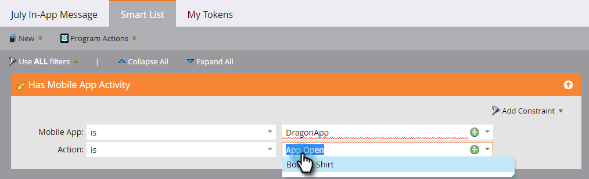

# 设置应用程序内消息受众 {#set-your-in-app-message-audience}

第一步是决定应该接收应用程序内消息的人员。 您需要设置智能列表。

1. 单击 **[!UICONTROL Edit Smart List]**。

   

1. 在智能列表中，**[!UICONTROL Has Mobile App Activity]**&#x200B;触发器被自动填充。 单击下拉列表，然后选择要将消息放入其中的应用程序。

   

   >[!NOTE]
   >
   >应用程序内消息程序当前不支持“移动设备应用程序”字段的多个值。

1. **[!UICONTROL App Open]**&#x200B;是默认的操作设置，但您可以选择已设置的任何自定义事件。

   

   >[!NOTE]
   >
   >默认触发器([!UICONTROL App Open])和开发人员添加到代码的任何自定义触发器会自动显示在[!UICONTROL Action]选择器中。 如果缺少自定义事件，请与开发人员核实，确保他们已将自定义事件添加到应用程序。 请注意，自定义事件编码和批准流程可能需要一些时间才能完成。 有关详细信息，请参阅[本文](/help/marketo/product-docs/mobile-marketing/admin/before-you-create-push-notifications-and-in-app-messages.md)。

1. 如果需要约束，约束可用于&#x200B;**[!UICONTROL Has Mobile App Activity]**&#x200B;触发器。

   

1. 您可以将过滤器添加到智能列表，以限制接收应用程序内消息的人员。 在此示例中，使用&#x200B;**[!UICONTROL Acquisition Date]**&#x200B;过滤器时，只向2016年6月9日获得的用户发送应用程序内消息。

   

1. 返回到应用程序内消息控制面板。 在下拉列表中设置显示限制。

   

   >[!NOTE]
   >
   >默认显示限制为&#x200B;**[!UICONTROL Once per session]**。 如果希望邮件在收件人回复后停止显示，请选择&#x200B;**[!UICONTROL Every time until tapped]**。 如果每次都显示它，无论收件人做什么，请选择&#x200B;**[!UICONTROL Every time]**。

   

做得不错！你的观众已经准备好了。 您已获得蓝色条和绿色复选标记。

[选择应用程序内消息的时间](/help/marketo/product-docs/mobile-marketing/in-app-messages/sending-your-in-app-message/select-your-in-app-message.md)！
