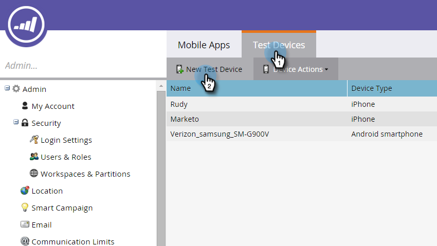

# 添加新测试设备 {#adding-a-new-test-device}

可以轻松添加新的测试设备以将通知推送到。

>[!NOTE]
>
>**需要管理员权限**

1. 单击 **管理员** 然后 **移动应用程序** 链接。

   

1. 单击 **测试设备** 选项卡和 **新测试设备**.

   

1. 选择您的应用程序。

   

1. 您可以通过两种方式将设备连接到应用程序。

   对于第一个选项，只需从字段中复制URL，然后通过电子邮件或短信将其发送到您的设备即可。 在设备中，点按URL。

   

   或者，使用第二个选项，单击第二个按钮并使用您的设备扫描二维码。

   

1. 应用程序随即打开。 命名设备并点按 **是**.

   

   成功!

   

1. 状态更新以显示设备已添加。 恭喜！

   
