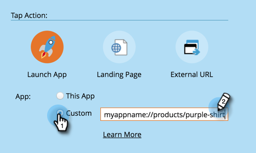

# 配置移动推送通知 {#configure-mobile-push-notification}

1. 转到 **营销活动** 区域。

1. 选择您的推送资源并单击 **编辑草稿**.

   

1. 转到 **设置**.

   

1. 选择所需的应用程序。 默认情况下，Android和Apple平台处于启用状态。

   

1. 如果您的推送消息仅应用于一个平台（例如，iPhone的情况），则可以通过将其选择器滑动到“已禁用”来排除另一个平台。

   

1. 单击 **下一个**.

   

1. 输入消息文本或选择令牌图标以添加令牌。 然后，选择 **点按操作**.

   

   >[!NOTE]
   >
   >如果启用了平台，它将显示在电话屏幕的左侧。 选中后，它会以彩色显示。

   >[!NOTE]
   >
   >有三种类型的点按操作：
   >
   >**启动应用程序** - **此应用程序** 在点按通知时打开应用程序的主页。 **自定义** 使用深层链接打开应用程序的其他区域或您拥有链接的任何其他应用程序(请参阅 [深层链接URI](#Deeplink) 详情请参阅下文)。
   >
   >**登陆页面**  — 将您转到指定的Marketo登录页面。
   >
   >**外部URL**  — 转到非Marketo登录页面。

1. 要为自定义点击操作插入深层链接，请单击自定义，然后输入 [深层链接URI](#Deeplink) 在栏位中。

   

1. 要插入令牌，请选择令牌，输入默认值，然后单击“插入”。

   >[!NOTE]
   >
   >在文本框中放置光标的位置会显示令牌。 您可以使用多个令牌。

   

   >[!NOTE]
   >
   >消息和点按操作在这两个平台上的外观相同。

1. 仅适用于iOS，请选中此复选框以指示应用程序在消息到达时播放声音。 Android会自动播放声音。

   

1. 预览其他平台并单击 **完成**.

   

1. 单击 **批准并关闭**.

   

恭喜！现在，推送通知已准备好发送。

## 深层链接URI {#deep-link-uris}

当订阅者单击推送消息中的按钮时，可以将其转到应用程序的主页或直接转到应用程序中的特定页面。 深层链接是对应用程序中特定页面的唯一引用，看起来与网站链接非常相似。

深层链接URI由三部分组成：方案名称、路径和标识符。 在以下示例中，“myappname”是方案。 “products”是路径，“purple-shirt”是标识符。 当客户点按时，它们会被特别带入您应用程序产品页面中的紫色衬衫项目。

也就是说，您应用程序的深层链接结构可能与上面的示例不同。 您的开发人员在定义深层链接URI时有许多选项，因此请让您的开发人员向您发送您有兴趣使用的页面的URI（链接）。 这将确保您在推送消息中输入的URI指向正确的位置。 您的开发人员可以 [在此处查找更多信息](https://developers.marketo.com/mobile/enabling-deep-links-in-your-app/).

>[!MORELIKETHIS]
>
>[发送移动推送通知](/help/marketo/product-docs/mobile-marketing/push-notifications/send-a-mobile-push-notification.md)
