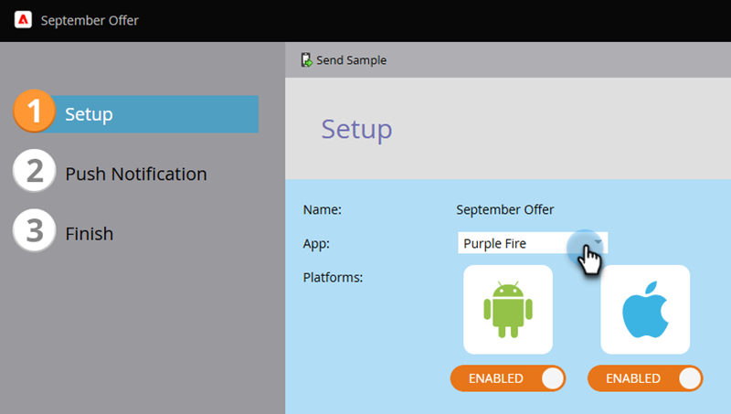

# 配置移动推送通知 {#configure-mobile-push-notification}

1. 转到&#x200B;**[!UICONTROL Marketing Activities]**&#x200B;区域。

   

1. 选择您的推送资源并单击&#x200B;**[!UICONTROL Edit Draft]**。

   

1. 在&#x200B;**设置**&#x200B;中，选择所需的应用程序。 Android和Apple平台默认处于启用状态。

   

   >[!NOTE]
   >
   >如果您的推送消息仅应用于一个平台(例如iOS)，则可以通过手动将其选择器滑动到&#x200B;**已禁用**&#x200B;来排除另一个平台。

1. 单击 **[!UICONTROL Next]**。

   

1. 输入消息文本或选择令牌图标以添加令牌（在此编辑器中，令牌的格式为[，因为它们通常为](/help/marketo/product-docs/demand-generation/landing-pages/personalizing-landing-pages/tokens-overview.md) — 您可以使用多个令牌）。 选择&#x200B;**点按操作**。

   

   >[!NOTE]
   >
   >如果启用了平台，它将显示在电话屏幕显示的左侧。 选中后，它会以彩色显示。

   >[!NOTE]
   >
   >有三种类型的[!UICONTROL Tap Actions]：
   >
   >**启动应用程序** - **此应用程序**&#x200B;在点按通知时打开应用程序的主页。 **自定义**&#x200B;使用深层链接打开应用程序的其他区域或您拥有该链接的任何其他应用程序（有关详细信息，请参阅下面的[深层链接URI](#deep-link-uris)）。
   >
   >**[!UICONTROL Landing Page]** — 将您转到指定的Marketo登录页面。
   >
   >**[!UICONTROL External URL]** — 将您转到非Marketo登录页面。

1. 要为自定义点击操作插入深层链接，请选择&#x200B;**自定义**&#x200B;并在字段中输入[深层链接URI](#deep-link-uris)。

   

   >[!NOTE]
   >
   >消息和点按操作在这两个平台上的外观都相同。

1. 仅对于iOS，选中此复选框可告知应用程序在消息到达时播放提示音。 Android会自动播放声音。

   

1. 预览其他平台并单击&#x200B;**[!UICONTROL Finish]**。

   

1. 单击 **[!UICONTROL Approve and Close]**。

   

恭喜！现在，推送通知已准备好发送。

## 深层链接URI {#deep-link-uris}

当订阅者单击推送消息中的按钮时，该按钮会将他们转到您应用程序的主页或直接转到应用程序内的特定页面。 深层链接是对应用程序中特定页面的唯一引用，看起来与网站链接非常相似。

深层链接URI由方案名称、路径和标识符三部分组成。 在以下示例中，“myappname”是方案。 “products”是路径，“purple-shirt”是标识符。 当客户点按时，它们会被特别引入到应用程序产品页面中的紫色衬衫项目中。

也就是说，您应用程序的深层链接结构可能与上述示例不同。 您的开发人员在定义深层链接URI时有很多选项，因此请让您的开发人员向您发送您有兴趣使用的页面的URI（链接）。 这将确保您在推送消息中输入的URI指向正确的位置。 您的开发人员可以[在此查找更多信息](https://experienceleague.adobe.com/en/docs/marketo-developer/marketo/mobile/enabling-deep-links-in-your-app)。

>[!MORELIKETHIS]
>
>[发送移动推送通知](/help/marketo/product-docs/mobile-marketing/push-notifications/send-a-mobile-push-notification.md)
