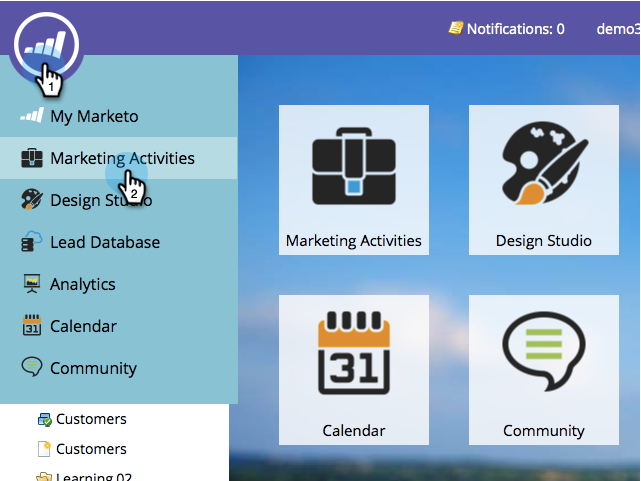

# 创建推送通知{#create-a-push-notification}

创建推送通知很简单。 但是，在开始之前，您必须让您的Marketo Admin和Mobile Apps Developer设置您在进行操作时需要的一些内容。 有关详细信息，请参阅[了解推送通知](/help/marketo/product-docs/mobile-marketing/push-notifications/understanding-push-notifications.md)。

1. 转至&#x200B;**营销活动**&#x200B;区域。

   

1. 查找并选择您的项目。

   

1. 在&#x200B;**New**&#x200B;下，单击&#x200B;**新建本地资产**。

   

1. 选择&#x200B;**推送通知**。

   

1. 输入&#x200B;**推送通知名称**，然后单击&#x200B;**创建**。

   

   真贴心！ 既然已创建推送通知，让我们继续并且[将其包装为](/help/marketo/product-docs/mobile-marketing/push-notifications/configure-mobile-push-notification.md)。
