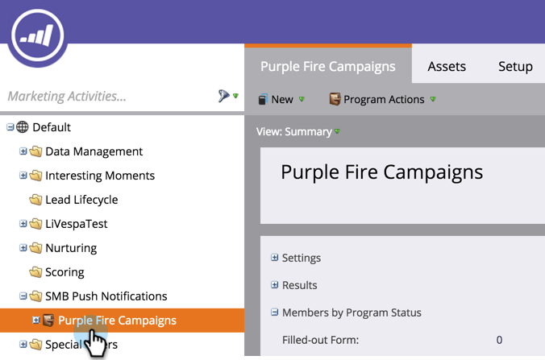

# 创建推送通知 {#create-a-push-notification}

创建推送通知很容易。 但是，在开始之前，您必须让Marketo管理员和移动设备应用程序开发人员设置一些您在执行此操作时所需的项目。 有关详细信息，请参阅[了解推送通知](/help/marketo/product-docs/mobile-marketing/push-notifications/understanding-push-notifications.md)。

1. 转到&#x200B;**[!UICONTROL Marketing Activities]**&#x200B;区域。

   

1. 查找并选择您的项目。

   

1. 在&#x200B;**[!UICONTROL New]**&#x200B;下，单击&#x200B;**[!UICONTROL New Local Asset]**。

   

1. 选择 **[!UICONTROL Push Notification]**。

   

1. 输入&#x200B;**推送通知名称**&#x200B;并单击&#x200B;**[!UICONTROL Create]**。

   

   真贴心！ 现在推送通知已创建，让我们继续[将其打扮](/help/marketo/product-docs/mobile-marketing/push-notifications/configure-mobile-push-notification.md)。
