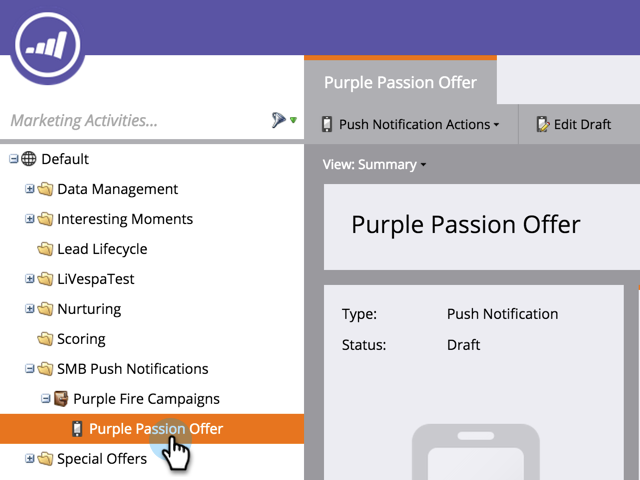
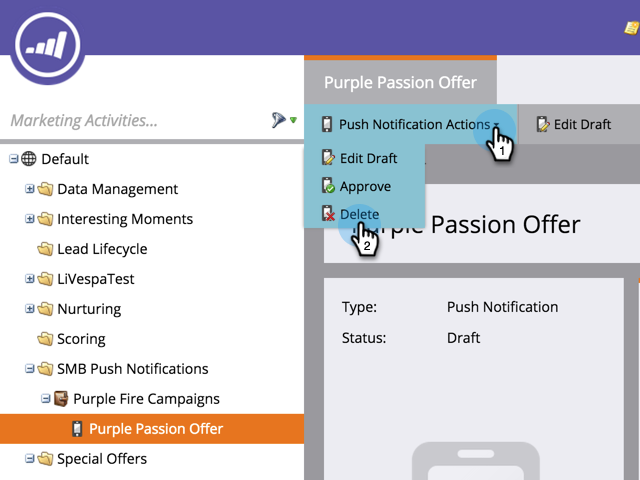

# 删除移动推送通知 {#delete-mobile-push-notification}

1. 进入 **[!UICONTROL Marketing Activities]** 区域。

1. 查找并选择您的移动推送通知。

   

1. 在&#x200B;**[!UICONTROL Push Notification Actions]**&#x200B;下，单击&#x200B;**[!UICONTROL Delete]**。

   

1. 单击&#x200B;**[!UICONTROL Delete]**&#x200B;确认。

   

   >[!NOTE]
   >
   >如果移动推送通知正由其他资产使用，则将不允许删除该通知。 您必须转到并将其从资源中删除。
