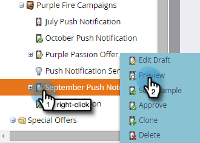
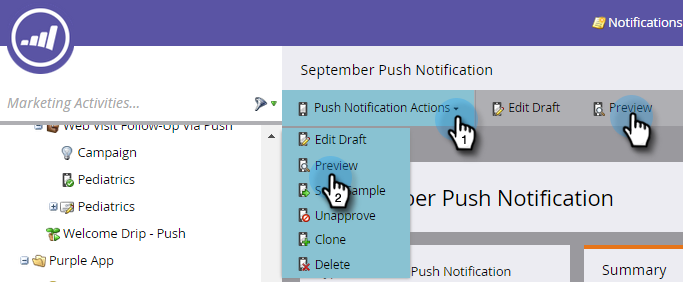

# 预览推送通知 {#preview-a-push-notification}

对于Android或iOS，可以轻松预览推送通知的外观。 有四种方法可以做到这一点。

在导航树中，右键单击要预览的通知文件，然后单击 **预览**.

>[!NOTE]
>
>如果仅为一个平台启用了推送通知，则不会显示另一个平台的选项卡。

或者，在推送通知视图页面上，单击 **推送通知操作** 然后 **预览**. 或者，单击 **预览** 极右翼。

最后，在编辑器中，您可以单击 **预览草稿** 选项卡。

## Android预览 {#android-previews}

单击左侧的图标可查看发送推送通知时推送通知的确切显示位置。 单击或使用键盘箭头在它们之间切换。

在主屏幕上，通知显示在顶部下方图标的下方。

在“锁定”屏幕上，它会在时间下方向下弹出。

>[!NOTE]
>
>Android中没有通知中心视图。

## iOS预览 {#ios-previews}

与Android一样，单击或使用键盘箭头在视图之间切换。

在主屏幕上，通知显示在顶部。

在“锁定”屏幕上，它显示一段时间的下移。

在“通知中心”屏幕上，它就在顶部附近，

因此，通过推送通知预览，您始终知道客户将看到什么！

>[!MORELIKETHIS]
>
>* [创建推送通知](/help/marketo/product-docs/mobile-marketing/push-notifications/create-a-push-notification.md)
>* [配置移动推送通知](/help/marketo/product-docs/mobile-marketing/push-notifications/configure-mobile-push-notification.md)
