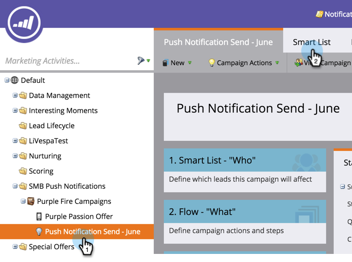

# 发送移动推送通知{#send-a-mobile-push-notification}

使用您的移动应用程序向他人发送推送通知。

>[!PREREQUISITES]
>
>* [创建新的智能活动](/help/marketo/product-docs/core-marketo-concepts/smart-campaigns/creating-a-smart-campaign/create-a-new-smart-campaign.md)
>* [创建推送通知](/help/marketo/product-docs/mobile-marketing/push-notifications/create-a-push-notification.md)

1. 转至&#x200B;**营销活动**&#x200B;区域。

   

1. 选择您的智能活动，然后单击&#x200B;**智能列表**。

   

1. 定义您的智能列表，然后单击&#x200B;**流量**。

   

1. 选择推送通知。 单击&#x200B;**计划**。

   

   >[!NOTE]
   >
   >推送通知必须获得批准，才能显示在下拉列表中。

1. 单击&#x200B;**运行一次**。

   

1. 选择日期和时间。 单击&#x200B;**保存**。

   

坐下，等待推送通知发出。
