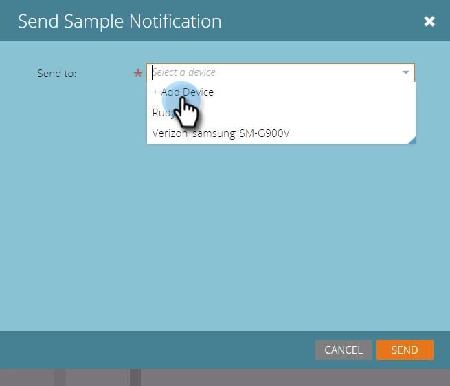
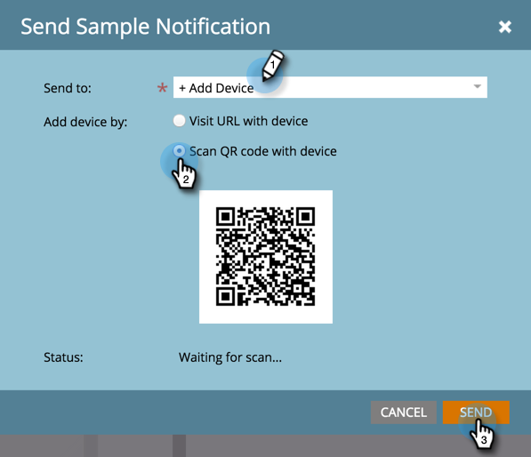

# 发送推送通知示例 {#send-a-push-notification-sample}

您可以发送示例来验证推送通知是否正常工作！

>[!PREREQUISITES]
>
>确保将示例发送到的设备上已安装应用程序。

1. 可通过三种方式发送示例：

   在左侧的树中，右键单击推送通知资产并单击 **发送示例**.

   

   或者，从推送通知操作菜单中，单击 **发送示例**.

   

   或者，在推送通知编辑器中，单击 **发送示例**.

   

1. 如果已设置要使用的测试设备，则只需从列表中选择该设备。

   

   或者，单击 **添加设备** 到 [添加新测试设备](/help/marketo/product-docs/mobile-marketing/push-notifications/adding-a-new-test-device.md) 将示例发送至。

   

1. 您可以通过两种方式将设备连接到应用程序。

   使用第一个选项，单击 **使用设备访问URL** 按钮，从字段中复制URL并以电子邮件或短信的形式将其发送到您的设备。 在设备中，点按URL。 当状态显示连接时，单击 **发送**.

   

   或者，使用第二个选项，单击 **使用设备扫描二维码** 按钮并在设备上扫描二维码。 当状态显示连接时，单击 **发送**.

   

   >[!TIP]
   >
   >是否成功添加了一个测试设备，但未在 **发送至** 字段？ 选中这些项以进行故障排除：
   >
   >* 将为与推送通知关联的应用程序启用推送通知。
   >
   >* 已为测试设备的平台配置推送通知。 例如，如果您刚刚将iPhone添加为测试设备，请确保为iOS启用了推送通知。

放轻松！
