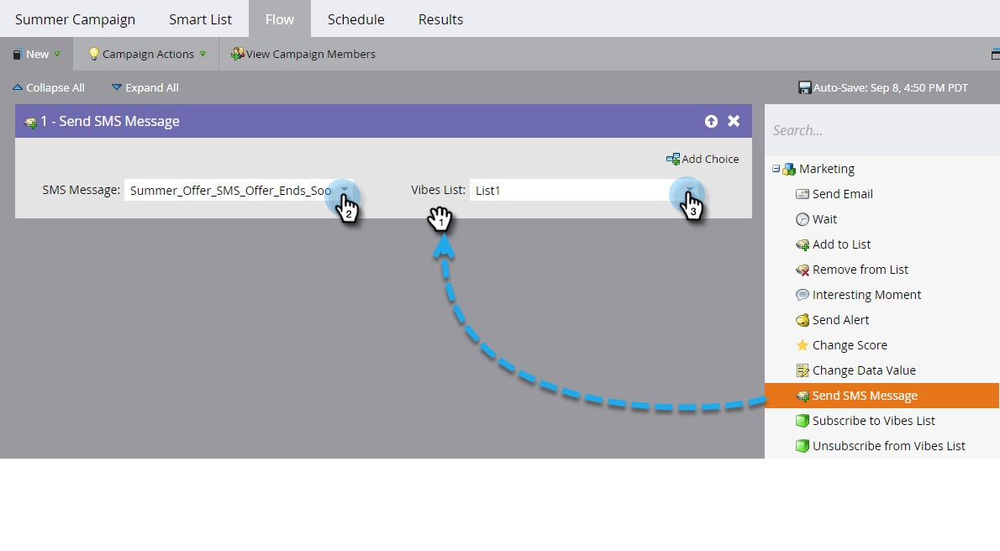

# 为SMS {#add-a-flow-step-for-sms}添加流步骤

Marketo有三个流程步骤，您可以在SMS智能活动中使用：

* **发送SMS消息**  — 此流操作向订阅用户选择的Vibes订阅列表的Marketo智能列表用户发送消息。它不会启动订阅进程。
* **订阅Vibes列表**  — 此流动操作通过用户选择的Vibes客户获取活动启动SMS订阅过程。然后，Vibes会发送确认消息；收件人必须回复它才能完成订阅过程。
* **取消订阅Vibes列表**  — 此流式操作取消每个人对用户选择的Vibes订阅列表的订阅。

>[!NOTE]
>
>发送SMS消息时：
>
>* Marketo通过电话号码消除重复。 因此，如果多个人具有相同的电话号码，只有一个人会收到该消息。
>* Marketo不会发送给被或市场列入阻止列表营销暂停的人员。

有关设置流步骤的一般信息，请参阅[向智能活动添加流步骤](/help/marketo/product-docs/core-marketo-concepts/smart-campaigns/flow-actions/add-a-flow-step-to-a-smart-campaign.md)。

以下是使用SMS的基础知识。

1. 在“我的营销人员”中，单击&#x200B;**营销活动**。

   

1. 查找要添加SMS流的智能活动。 单击&#x200B;**Flow**&#x200B;选项卡。

   

1. 在流上拖动，例如&#x200B;**发送SMS消息**。 从下拉菜单中选择SMS消息和Vibes列表。

   

   >[!NOTE]
   >
   >“Vibes列表”选择器用作对智能列表中已识别的受众的进一步过滤器，以仅目标属于该“Vibes列表”的潜在客户。
   >
   >**订阅Vibes列表**&#x200B;和&#x200B;**取消订阅Vibes列表**&#x200B;流有不同的要求。 对于&#x200B;**订阅**，必须选择“Vibes”列表和“Vibes”客户获取活动。 对于&#x200B;**取消订阅**，只需使用Vibes列表。
