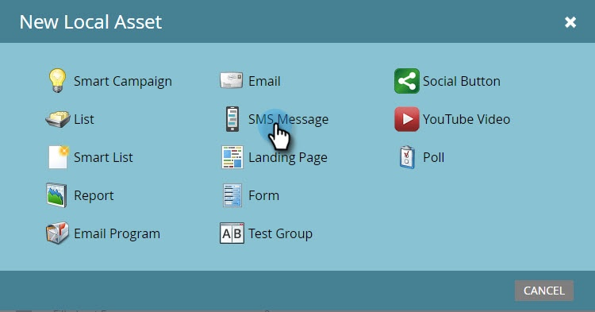
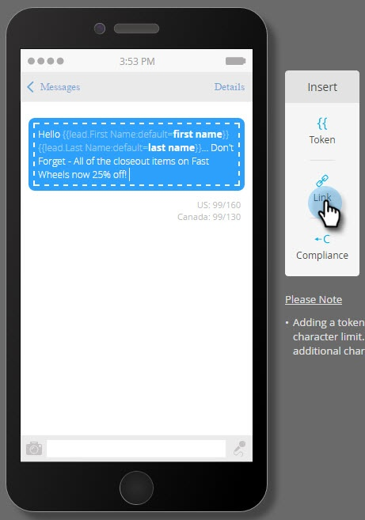

# 创建访客SMS消息 {#create-a-vibes-sms-message}

以下是如何创建访客短信消息。

>[!AVAILABILITY]
>
>此功能可用作您的Adobe Marketo Engage帐户的加载项。 为了进行正确配置，必须通过Adobe购买。 有关详细信息，请联系Adobe客户团队（您的客户经理）。

>[!NOTE]
>
>短信短信不符合HIPAA标准。

1. 转到 **营销活动** 并右键单击某个项目。

   

1. 单击 **新建本地资产**.

   

   >[!TIP]
   >
   >或者，您可以单击 **新建** 下拉菜单。

1. 单击 **SMS消息**.

   

1. 输入新短信消息的名称和可选描述，然后单击 **创建**.

   

1. 单击 **编辑草稿**.

   

1. 在消息编辑器中，单击蓝色气泡并开始输入文本。

   

   >[!NOTE]
   >
   >美国和加拿大的限制有所不同，分别为160和130个字符。 如果超过这些字符限制，则可能会拆分消息。 虽然我们会在您超出加拿大限制时显示编辑器，但它已针对美国进行了优化，并根据美国限制拆分消息。

1. 单击 **令牌** 在插入菜单中，向消息中添加令牌。

   

   >[!NOTE]
   >
   >添加令牌可能会导致消息超出字符限制。 然后，该消息将被拆分，从而导致额外费用。

1. 单击 **链接** 在“插入”菜单中添加指向消息的链接。

   

1. 选择链接类型。 默认“Marketo登录页面”。 如果您选择登陆页面，则需要从下拉列表中选择该登陆页面，然后单击 **插入**.

   

   >[!NOTE]
   >
   >默认情况下，将选择两个跟踪链接。

1. 如果要改用外部URL，请单击 **外部URL** 按钮，并在URL字段中输入URL。 单击 **插入**.

   

1. 该链接将显示在消息中。

   

   >[!NOTE]
   >
   >Marketo显示品牌跟踪域的链接预览。 如果清除mkt_tok链接复选框，则链接会更改。 同时清除跟踪链接复选框，URL将缩短为其基本长度(例如，www.mygooglepage.com)。

   

   >[!NOTE]
   >
   >字符数仅反映最低级别消息中包含的字符。

如果插入的内容超过美国的限制，编辑器会将您的消息分成多个部分。 绝对总限制为900个字符。 达到该限制后，在将消息发送到其受众时，该消息将自动被截断。
