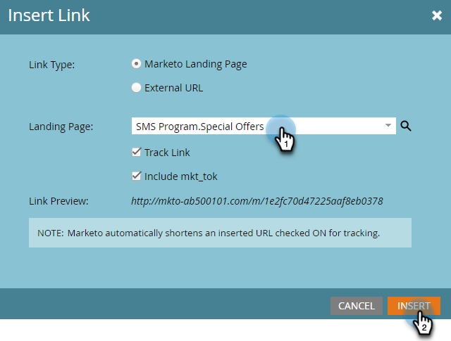

# 创建短信消息 {#create-an-sms-message}

以下是如何创建短信消息。

>[!AVAILABILITY]
>
>此功能可用作您的Adobe Marketo Engage帐户的加载项。 为了进行正确配置，必须通过Adobe购买它。 有关详细信息，请联系Adobe客户团队（您的客户经理）。 Marketo Vibes SMS原生集成在美国和加拿大提供。 对于其他国家/地区，可以通过[直接联系Vibes](https://www.vibes.com/talk-to-sales)来利用通过Marketo Webhook的连接。

>[!PREREQUISITES]
>
>[将Vibes添加为LaunchPoint服务](/help/marketo/product-docs/mobile-marketing/admin/add-vibes-as-a-launchpoint-service.md){target="_blank"}

1. 转到&#x200B;**[!UICONTROL 营销活动]**。

   

1. 右键单击所需的项目并选择&#x200B;**[!UICONTROL 新建本地资产]**。

   

1. 选择&#x200B;**短信消息**。

   

1. 输入新短信消息的名称和可选描述，然后单击&#x200B;**创建**。

   

1. 在编辑器中，单击蓝色气泡并开始输入文本。

   

   >[!NOTE]
   >
   >使用标准ASCII字符集时，短信消息的字符限制为160个字符。 如果超过160个字符，则消息将根据字符总数进行拆分。

1. 若要在邮件中添加令牌，请编写快速问候语，然后单击&#x200B;**令牌**。

   

   >[!NOTE]
   >
   >添加令牌可能会导致消息超出字符限制。 然后，该消息将被拆分，从而创建一个额外的消息。

   >[!IMPORTANT]
   >
   >SMS合规性：所有出站SMS消息必须包含品牌名称或程序描述。 对于定期消息程序，每个订阅者应至少每月提供一次HELP和STOP指令。

1. 选择所需的&#x200B;**令牌**，输入可选的&#x200B;**默认值**，然后单击&#x200B;**创建**。

   

1. 要添加链接，请选择邮件中您希望链接出现的位置，然后单击&#x200B;**链接**。

   

1. 选择链接类型。 默认“Marketo登录页面”。 如果您选择此选项，请单击登陆页面下拉列表，然后选择所需的页面。 完成后单击&#x200B;**插入**。

   

   >[!NOTE]
   >
   >默认情况下，将选择两个跟踪链接。 取消选中仅包含mkt_tok仍允许跟踪链接，但在重定向后，目标URL将不包含mkt_tok查询字符串参数。 此参数由Marketo登录页面和Munchkin使用，以确保正确跟踪人员活动（如人员选择退出时）。

1. 如果要改用外部URL，请选择&#x200B;**外部URL**，输入/粘贴该URL，然后单击&#x200B;**插入**。

   

   >[!NOTE]
   >
   >在保持选中“跟踪链接”的状态时，Marketo将自动修改URL以进行跟踪。 如果您选择禁用跟踪，则未更改的消息中将显示URL（例如，`www.adobe.com`）。

   >[!CAUTION]
   >
   >建议&#x200B;_不_&#x200B;使用URL缩短服务（例如Bitly），因为运营商可能会将您的邮件标记为垃圾邮件。

1. 该链接将显示在消息中。

   

   >[!NOTE]
   >
   >Marketo显示品牌跟踪域的链接预览。 如果清除mkt_tok链接复选框，则链接会更改。

如果插入的字符数超过160个，编辑器会将短信分成多个部分。 每条消息的总限制为900个字符。 如果超过此值，则消息将在投放时被截断。
