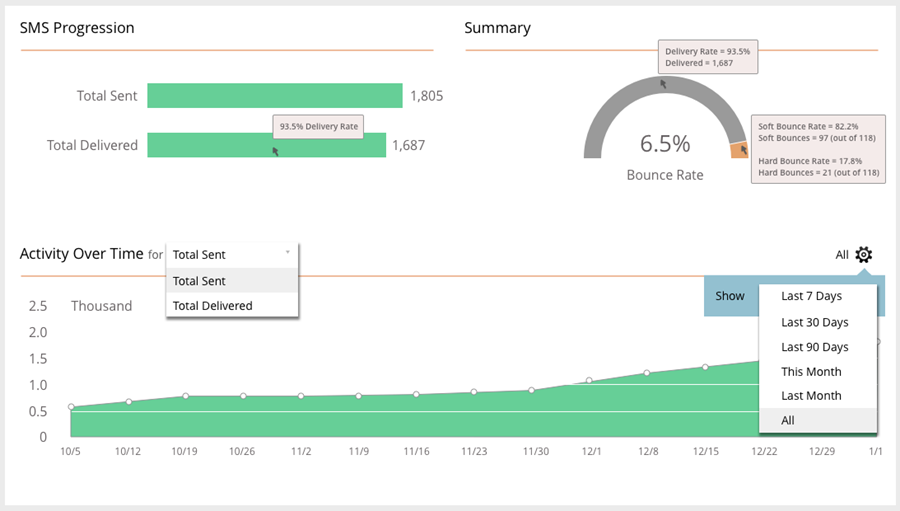

# 短信报告 {#sms-reporting}

短信消息仪表板提供有关消息的有用报告分析。

## 访问功能板 {#access-the-dashboard}

1. 要查看报表，请选择所需的短信消息。 单击 **视图** 下拉并选择 **仪表板**.

   

1. 此时将显示仪表板。

   

## 功能板概述 {#dashboard-overview}

### SMS进度 {#sms-progression}

显示已发送总数和已发送总数。 金额位于右侧，如果将鼠标悬停在条形图上，则会显示百分比。

### 概要 {#summary}

以百分比显示计算的跳出率。 将鼠标悬停在存档栏上，以查看按金额和百分比列出的投放率。 将鼠标悬停在栏的橙色跳出率部分上可查看软跳出率和硬跳出率金额/百分比。

### 一段时间内的活动 {#activity-over-time}

允许您选择“已发送总数”或“已发送总数”。 从日期范围选择器中选择适当的范围。

