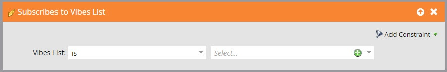

# 在智能列表触发器和过滤器中使用Vibes SMS消息 {#use-vibes-sms-messages-in-smart-list-triggers-and-filters}

在您之后 [创建Vibes SMS消息](/help/marketo/product-docs/mobile-marketing/vibes-sms-messages/create-a-vibes-sms-message.md)，您将在智能营销活动中使用智能列表触发器和过滤器以获得好处。 下面是具体操作方法。

1. 在“我的Marketo”中，单击 **营销活动**.

   

1. 选择要在其中使用短信资源的智能营销活动。 拖动到触发器上，例如受欢迎的 **填写表单**.

   

## SMS触发器 {#sms-triggers}

还有其他可用的短信触发器。 仅当启用了Vibes服务时，才会显示SMS触发器。

下面是一些示例：

短信消息退回触发器会在短信消息退回时启动流程，例如发送电子邮件。

此 **Vibes列表的订阅次数** 触发器会在人员订阅时启动流。

此 **短信消息中的点击链接** 当人员单击短信消息中的链接时，触发器将启动流。

## 短信过滤器 {#sms-filters}

您还可以在智能列表中使用维贝过滤器。 此 **已订阅的Vibes列表** 筛选器查找具有 *从不* 订阅了Vibes。 这包括已取消订阅和已删除的人员，即使已删除的人员将从流量中忽略。 此过滤器最适合报表。

相比之下， **Vibes列表的成员** 筛选查找 _任何人_ 当前已订阅的Vibes，最适合用于智能营销活动或列表。

>[!NOTE]
>
>所有短信过滤器都包含 **活动日期** 约束。

在智能列表中设置Vibes触发器和过滤器后，您可以 [定义流](/help/marketo/product-docs/mobile-marketing/vibes-sms-messages/add-a-flow-step-for-sms.md).

>[!MORELIKETHIS]
>
>* [为智能营销活动定义智能列表 |触发器](/help/marketo/product-docs/core-marketo-concepts/smart-campaigns/creating-a-smart-campaign/define-smart-list-for-smart-campaign-trigger.md)
>* [查找筛选器并将其添加到智能列表](/help/marketo/product-docs/core-marketo-concepts/smart-lists-and-static-lists/creating-a-smart-list/find-and-add-filters-to-a-smart-list.md)
