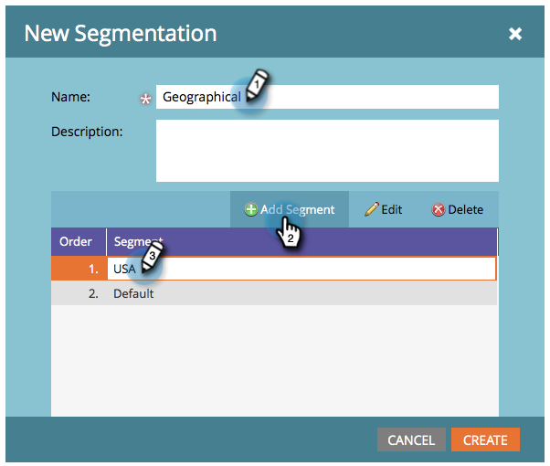

# 创建分段{#create-a-segmentation}

分段允许您将人员分组到不同的用户档案中，以获得报告和动态内容。 下面将介绍如何创建它们。

1. 转到&#x200B;**Database**。

   

1. 单击**新建**，然后单击&#x200B;**新建分段**。

   

   >[!TIP]
   >
   >您最多可创建20个细分。

1. 输入&#x200B;**名称**，单击**添加** **区段**&#x200B;并命名它。

   

   >[!NOTE]
   >
   >无法移动、编辑或删除默认值。

1. 添加任意数量的区段（最多100个）。

   

   >[!CAUTION]
   >
   >在细分中可创建的区段总数取决于所使用的过滤器数和类型，也取决于区段逻辑的复杂程度。 虽然您可以使用标准字段创建多达100个区段，但使用其他类型的过滤器会增加复杂性，并且您的细分可能无法批准。 例如：自定义字段、列表成员、潜在客户所有者字段和收入阶段。
   >
   >
   >如果您在审批过程中收到错误消息并需要帮助降低分段的复杂性，请联系[Marketo Support](https://docs.marketo.com/cdn-cgi/l/email-protection#e794929797889593a78a86958c829388c984888a)。

1. 拖放区段以更改其顺序。 完成后，单击&#x200B;**创建**。

   

   >[!NOTE]
   >
   >在定义的[order](segmentation-order-priority.md)中，人符合第一个匹配段的资格。

   >[!NOTE]
   >
   >**提醒**
   >
   >
   >您需要先定义区段规则，然后才能使用区段。

   >[!MORELIKETHIS]
   >
   >
   >    
   >    
   >    * [定义区段规则](define-segment-rules.md)

恭喜！ 您距离使用动态内容只有一步之遥。