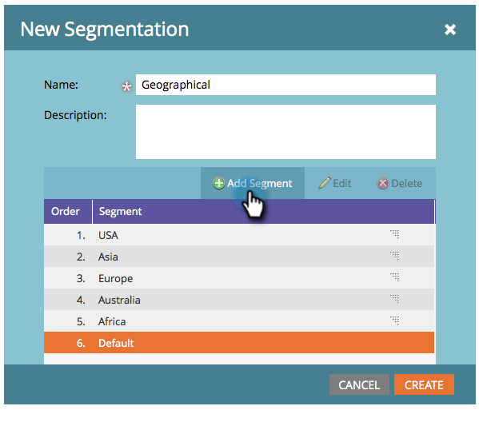

# 创建分段 {#create-a-segmentation}

分段允许您将人员分组到不同的配置文件中，以便生成报告和动态内容。 下面是创建这些规则的方法。

1. 转到 **数据库**.

   

1. 单击 **新建** 然后 **新区段**.

   

   >[!TIP]
   >
   >您最多可以创建20个分段。

1. 输入 **名称**，单击 **添加区段** 并为其命名。

   

   >[!NOTE]
   >
   >默认无法移动、编辑或删除。

1. 添加所需数量的区段（最多100个）。

   

   >[!CAUTION]
   >
   >可在区段中创建的区段总数，取决于所使用的过滤器的数量和类型，还取决于区段的逻辑复杂程度。 虽然您可以使用标准字段创建最多100个区段，但使用其他类型的过滤器可能会增加复杂性，并且您的区段可能无法批准。 例如：自定义字段、列表成员、潜在客户所有者字段和收入阶段。
   >
   >如果您在审批期间收到错误消息，并且需要协助降低分段的复杂性，请联系 [Marketo支持](https://nation.marketo.com/t5/Support/ct-p/Support).

1. 将区段拖放至周围以更改其顺序。 完成后，单击 **创建**.

   

   >[!NOTE]
   >
   >人员将有资格在 [订购](/help/marketo/product-docs/personalization/segmentation-and-snippets/segmentation/segmentation-order-priority.md) 已定义。

   >[!NOTE]
   >
   >您需要先定义区段规则，然后才能使用分段。

   恭喜！您距离使用动态内容又近了一步。

   >[!MORELIKETHIS]
   >
   >[定义区段规则](/help/marketo/product-docs/personalization/segmentation-and-snippets/segmentation/define-segment-rules.md)
