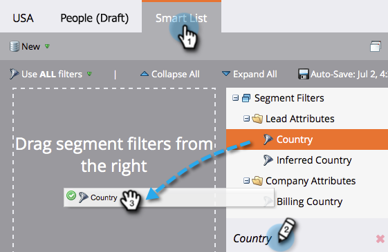

# 定义区段规则 {#define-segment-rules}

通过定义区段规则，可将人员划分为不同的互斥组。

>[!PREREQUISITES]
>
>[创建分段](/help/marketo/product-docs/personalization/segmentation-and-snippets/segmentation/create-a-segmentation.md)

1. 转到&#x200B;**[!UICONTROL Database]**。

   

1. 从树中选择&#x200B;**[!UICONTROL Segmentations]**，然后单击特定的&#x200B;**区段**。

   

1. 单击&#x200B;**[!UICONTROL Smart List]**&#x200B;并添加筛选器。

   

   >[!CAUTION]
   >
   >区段当前不支持筛选器上的&#x200B;_过去_&#x200B;内和&#x200B;_时间范围_&#x200B;内运算符。 这是因为分段仅在记录更改数据值时检查更新。 这些值&#x200B;_未_&#x200B;记录为自动更改的内容，如公式字段和日期。 此外，不支持具有相对日期范围的日期运算符，因为它们是在分段审批时计算的，而不是在更改数据值活动时计算的。

   >[!NOTE]
   >
   >分段智能列表当前不支持“SFDC类型”和“Microsoft类型”过滤器。

1. 为筛选器填充相应的值。

   

   >[!CAUTION]
   >
   >“帐户”字段的活动日志记录行为可能会影响资格。 因此，我们建议不要在定义区段规则时使用帐户字段。

1. 单击&#x200B;**[!UICONTROL People (Draft)]**&#x200B;选项卡以查看可能符合此区段成员资格的人员。

   

1. 前往 **[!UICONTROL Segmentation Actions]**。 单击 **[!UICONTROL Approve]**。

   

   >[!CAUTION]
   >
   >可在区段中创建的区段总数，取决于所使用的过滤器的数量和类型，还取决于区段的逻辑复杂程度。 虽然您可以使用标准字段创建最多100个区段，但使用其他类型的过滤器可能会增加复杂性，并且您的区段可能无法批准。 例如：自定义字段、列表成员、潜在客户所有者字段和收入阶段。
   >
   >如果您在审批期间收到错误消息，并且需要帮助来降低分段的复杂性，请联系[Marketo支持](https://nation.marketo.com/t5/Support/ct-p/Support)。

1. 请查看仪表板，以快速大致了解饼图中的区段以及应用的规则。

   

做得好！ 这些区段将在Marketo的许多地方派上用场。

>[!NOTE]
>
>人员可能有资格使用不同的区段，但最终仅属于一个区段，这取决于区段](/help/marketo/product-docs/personalization/segmentation-and-snippets/segmentation/segmentation-order-priority.md)的[优先级顺序。

>[!NOTE]
>
>[!UICONTROL People (Draft)]屏幕显示所有符合成员资格的人员，并不总是最终人员列表。 批准您的区段以查看最终列表。

>[!MORELIKETHIS]
>
>[批准分段](/help/marketo/product-docs/personalization/segmentation-and-snippets/segmentation/approve-a-segmentation.md)
