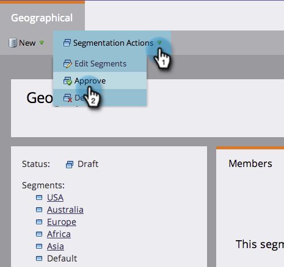
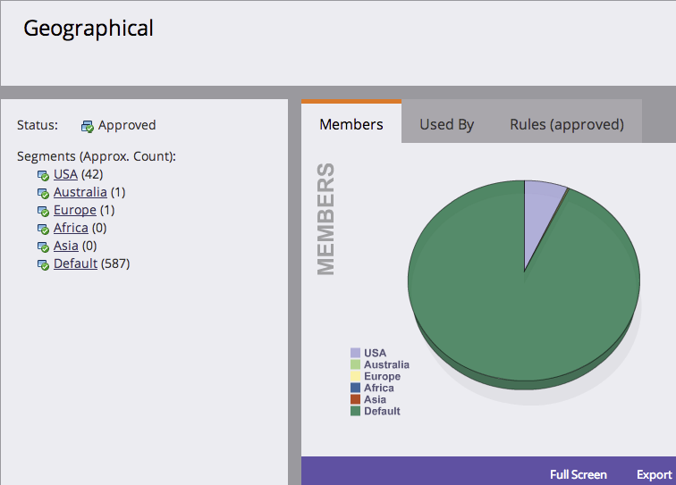

# 定义区段规则{#define-segment-rules}

通过定义区段规则，您可以将人员分类为不同的互斥组。

>[!PREREQUISITES]
>
>[创建分段](/help/marketo/product-docs/personalization/segmentation-and-snippets/segmentation/create-a-segmentation.md)

1. 转到&#x200B;**数据库。**

   

1. 单击树中的&#x200B;**分段**，然后单击特定&#x200B;**区段**。

   

1. 单击&#x200B;**智能列表**&#x200B;并添加过滤器。

   

   >[!CAUTION]
   >
   >区段当前不支持过滤器上的&#x200B;_In Past_&#x200B;和&#x200B;_In Timerame_&#x200B;运算符。 这是因为分段仅在记录更改数据值时检查更新。 这些值&#x200B;_不_&#x200B;记录用于自动更改的内容，如公式字段和日期。 此外，不支持具有相对日期范围的日期运算符，因为它们是在分段批准时计算的，而不是在“更改数据值”活动时计算的。

   >[!NOTE]
   >
   >分段智能过滤器当前不支持“SFDC类型”和“Microsoft类型”列表。

1. 为过滤器填充适当的值。

   

   >[!NOTE]
   >
   >智能列表太棒了。 [进一步了解它们](/help/marketo/product-docs/core-marketo-concepts/smart-lists-and-static-lists/understanding-smart-lists.md)。

1. 单击&#x200B;**人员（草稿）**&#x200B;选项卡，以视图可能符合此区段成员资格的人员。

   

1. 转到&#x200B;**分段操作**。 单击&#x200B;**批准**。

   

   >[!CAUTION]
   >
   >在细分中可创建的区段总数取决于所使用的过滤器数和类型，也取决于区段逻辑的复杂程度。 虽然您可以使用标准字段创建多达100个区段，但使用其他类型的过滤器会增加复杂性，并且您的细分可能无法批准。 例如：自定义字段、列表成员、潜在客户所有者字段和收入阶段。
   >
   >如果您在审批过程中收到错误消息并需要帮助降低分段的复杂性，请联系[Marketo Support](https://nation.marketo.com/t5/Support/ct-p/Support)。

1. 查看仪表板，快速概览饼图中的区段以及所应用的规则。

   

干得好！ 这些细分在Marketo的很多地方都会派上用场。

>[!NOTE]
>
>某人可能有资格访问不同的区段，但最终只属于取决于区段[优先级顺序](/help/marketo/product-docs/personalization/segmentation-and-snippets/segmentation/segmentation-order-priority.md)的区段。

>[!NOTE]
>
>“人员（草稿）”屏幕显示所有有资格成为会员且并不总是人员的最终列表。 批准您的区段以查看最终列表。

>[!MORELIKETHIS]
>
>[批准分段](/help/marketo/product-docs/personalization/segmentation-and-snippets/segmentation/approve-a-segmentation.md)
