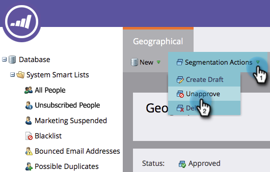

# 删除分段 {#delete-a-segmentation}

可以按照以下步骤删除分段。

1. 转到&#x200B;**[!UICONTROL Database]**。

   

1. 转到分段并单击&#x200B;**[!UICONTROL Used By]**&#x200B;以检查关联。

   

   如果您的分段被其他资产使用，请先删除所有这些关联，然后再继续。

1. 删除所有关联，然后在&#x200B;**[!UICONTROL Segmentation Actions]**&#x200B;中单击&#x200B;**[!UICONTROL Unapprove]**。

   

   >[!NOTE]
   >
   >您可以删除关联，方法是对使用分段的资产删除或创建替代项。

1. 取消批准后，单击&#x200B;**[!UICONTROL Segmentation Actions]**&#x200B;和[!UICONTROL Delete]分段。

   

就是这样。 你拿不回来，所以别再需要了。
