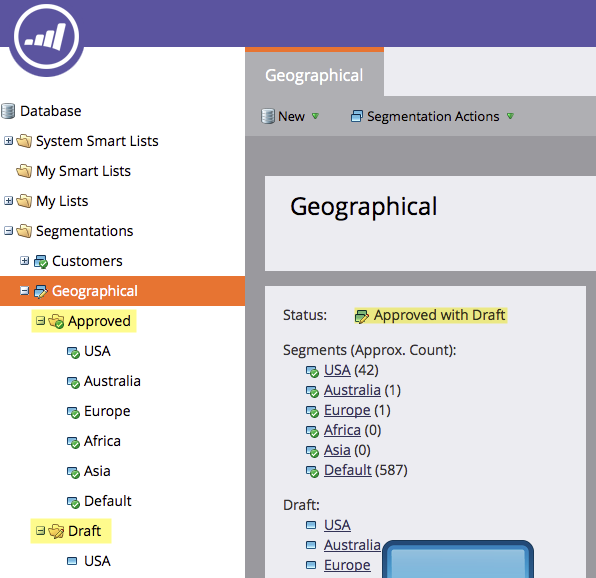

# 编辑分段 {#edit-a-segmentation}

对现有分段进行更改很容易。 下面是低层。

## 创建分段草稿 {#create-a-segmentation-draft}

1. 转到 **数据库**.

   

1. 在分段中，单击 **分段操作** 然后 **创建草稿**.

   

1. 此 **状态** 将更改更改为“已批准，但有草稿”。 A **草稿** 会在您的分段中创建文件夹。

   

## 添加、编辑或删除区段 {#add-edit-or-delete-segments}

1. 在分段中，单击 **分段操作** 然后 **编辑区段**.

   

   >[!NOTE]
   >
   >您只能编辑草稿的区段，不能编辑已批准的分段。

1. **添加区段**， **编辑** 现有（重命名或更改顺序）或 **删除** 任何区段。

   

   >[!NOTE]
   >
   >您需要先选择区段，然后才能编辑或删除它。

   >[!CAUTION]
   >
   >删除操作会影响电子邮件、登陆页面和代码片段中所有关联的动态内容。 **没有撤消操作**. 查看 **使用者** 选项卡以了解该区段的用途。

## 编辑区段规则 {#edit-segment-rules}

1. 在您的草稿中 **区段**，转到 **智能列表**. 应用类似于 [定义区段规则](/help/marketo/product-docs/personalization/segmentation-and-snippets/segmentation/define-segment-rules.md).

   

   >[!NOTE]
   >
   >您无法编辑已批准的区段。 单击草稿文件夹中的区段以编辑它们。

   >[!NOTE]
   >
   >切记要批准分段草稿。

您可以尝试未用于动态内容的区段。

>[!MORELIKETHIS]
>
>[删除分段](/help/marketo/product-docs/personalization/segmentation-and-snippets/segmentation/delete-a-segmentation.md)
