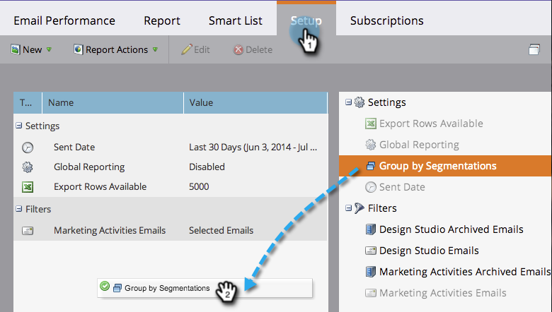

# 按分段对电子邮件报告进行分组 {#group-email-reports-by-segmentations}

区段不仅仅适用于动态内容。 您还可以按分段对电子邮件性能报表进行分组。

>[!PREREQUISITES]
>
>[批准分段](/help/marketo/product-docs/personalization/segmentation-and-snippets/segmentation/approve-a-segmentation.md)

1. 转到&#x200B;**[!UICONTROL Marketing Activities]**（或&#x200B;**[!UICONTROL Analytics]**）区域。

   

1. 选择您的&#x200B;**[!UICONTROL Email Performance]**&#x200B;报告。

   

1. 单击&#x200B;**[!UICONTROL Setup]**&#x200B;选项卡并拖到&#x200B;**[!UICONTROL Group by Segmentations]**&#x200B;上。

   

1. 选择一个或两个用于分组报表的区段。 单击 **[!UICONTROL Apply]**。

   

1. 单击 **[!UICONTROL Report]** 选项卡。 如果使用一种分段，则报表会为每个区段显示一行。

   

1. 如果使用两个分段，则会为区段的每个&#x200B;_组合_&#x200B;显示一行。

   

>[!MORELIKETHIS]
>
>[在电子邮件报告中筛选Assets](/help/marketo/product-docs/reporting/basic-reporting/report-activity/filter-assets-in-an-email-report.md)
