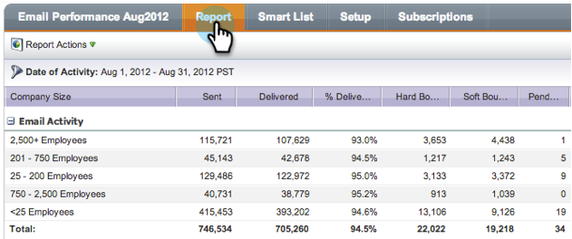

# 按区段对电子邮件报表进行分组 {#group-email-reports-by-segmentations}

分段不仅适用于动态内容。 您也可以按区段对电子邮件性能报表进行分组。

>[!PREREQUISITES]
>
>[批准分段](/help/marketo/product-docs/personalization/segmentation-and-snippets/segmentation/approve-a-segmentation.md)

1. 转到 **营销活动** (或 **Analytics**)区域。

   

1. 选择 **电子邮件性能** 报表。

   

1. 单击 **设置** 选项卡，并拖动 **按区段分组**.

   

1. 选择一个或多个用于对报表进行分组的区段。 单击 **应用**.

   

1. 就这样！ 单击 **报表** 选项卡。 如果使用一个分段，则报表会为每个区段显示一行。

   

1. 如果使用两个分段，则每个分段显示一行 _组合_ 区段。

   

>[!MORELIKETHIS]
>
>[在电子邮件报表中筛选资产](/help/marketo/product-docs/reporting/basic-reporting/report-activity/filter-assets-in-an-email-report.md)
