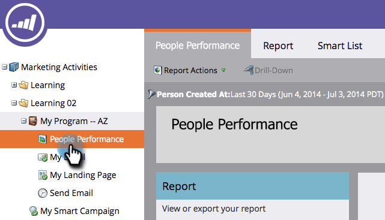

# 按区段分组人员报表 {#group-person-reports-by-segment}

您可以按在区段中定义的任何区段对人员报表进行分组。

1. 转到&#x200B;**营销活动** （或&#x200B;**Analytics**）部分。

   

1. 从导航树中选择人员报表。

   

1. 单击&#x200B;**设置**&#x200B;选项卡并双击&#x200B;**按**&#x200B;对人员分组。

   

   >[!NOTE]
   >
   >您还可以[按人员或公司属性](/help/marketo/product-docs/reporting/basic-reporting/report-activity/group-person-reports-by-attribute.md)对您的人员报表进行分组。

1. 在&#x200B;**按**&#x200B;分组人员对话框中，开始在文本框中键入“分段”。 当出现&#x200B;**分段**&#x200B;标题时，从标题下面的列表中选择一个标题。

   

1. 单击&#x200B;**报告**&#x200B;选项卡可查看按选定区段分组的报告。

   

>[!MORELIKETHIS]
>
>[将自定义列添加到人员报表](/help/marketo/product-docs/reporting/basic-reporting/editing-reports/add-custom-columns-to-a-person-report.md)
