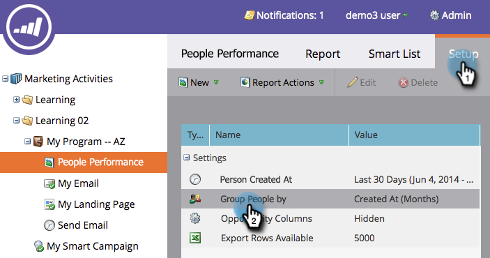

# 按区段{#group-person-reports-by-segment}分组人员报表

您可以按在您的区段中定义[的任何[区段](https://docs.marketo.com/display/docs/basic+reporting)对[人员报表](https://docs.marketo.com/display/docs/basic+reporting)进行分组。](create-a-segmentation.md)

1. 转至&#x200B;**营销活动**（或&#x200B;**Analytics**）部分。

   

1. 从导航树中选择您的人员报表。

   

   >[!NOTE]
   >
   >**深潜**
   >
   >
   >在[基本报告](https://docs.marketo.com/display/docs/basic+reporting)深入了解有关人员报告和其他报告类型的更多信息。

1. 单击&#x200B;**设置**&#x200B;选项卡，然后多次单击&#x200B;**将人员分组为**。

   

   >[!NOTE]
   >
   >您还可以[按个人或公司属性](https://docs.marketo.com/display/DOCS/Group+Person+Reports+by+Attribute)对您的个人报表进行分组。

1. 在&#x200B;**“Group People by**”对话框中，开始在文本框中键入“Segmentation”。 出现&#x200B;**分段**&#x200B;标题时，请从标题下方的列表中选择一个。

   

1. 单击&#x200B;**报表**&#x200B;选项卡，查看按选定区段分组的报表。

   

>[!NOTE]
>
>**深潜**
>
>要进一步了解细分以及如何创建和管理细分，请参阅[细分](https://docs.marketo.com/display/docs/segmentation+and+snippets)深入介绍。

>[!MORELIKETHIS]
>
>* [将自定义列添加到人员报表](../../../../product-docs/reporting/basic-reporting/editing-reports/add-custom-columns-to-a-person-report.md)

>

