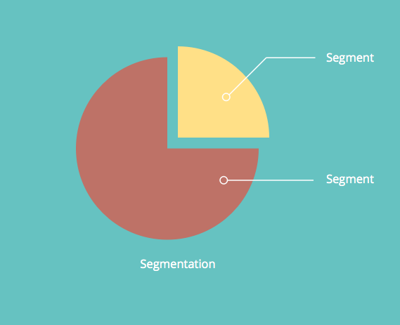
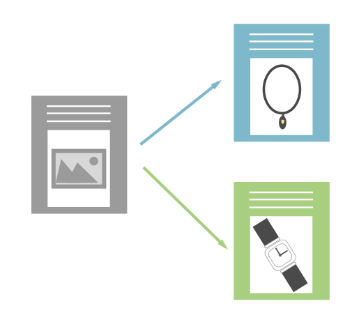

# 了解动态内容 {#understanding-dynamic-content}

要个性化，不仅仅是“您好 `{{First_Name}}`“。 借助Marketo动态内容，您可以自定义不同人员查看登陆页面或电子邮件的方式。

## 分段 {#segmentation}

首先，您需要将人员划分为多个子组。 这称为 [分段](/help/marketo/product-docs/personalization/segmentation-and-snippets/segmentation/create-a-segmentation.md).

>[!NOTE]
>
>**条件**
>
>分段根据将受众划分为不同的子组 [智能列表](/help/marketo/product-docs/core-marketo-concepts/smart-campaigns/understanding-smart-campaigns.md) 规则。 这些组称为区段。

例如，如果我们有一个称为行业的分段，那么一些区段可以是：医疗保健、技术、金融、消费品等。

## 动态内容 {#dynamic-content}

创建不同的区段后，您可以将动态内容块添加到登陆页面或电子邮件中。 这会告知Marketo您希望该内容段因查看者而异。

## 代码片段 {#snippets}

[代码片段](/help/marketo/product-docs/personalization/segmentation-and-snippets/snippets/create-a-snippet.md) 是Marketo中的一个有用工具。 只需创建一次，即可在多个位置使用！ 如果更新代码片段，则使用该代码片段的所有资产（登陆页面或电子邮件）将自动更新。

>[!NOTE]
>
>**示例**
>
>* 您可以在电子邮件中使用代码片段作为签名。 根据收件人的位置动态更改文本。
>* 在登陆页面上，有一个标准的行动号召区域，其中包含适用于客户与潜在客户的不同链接。 集中更新数百个LP。

试试看，告诉我们您的成功故事！

>[!MORELIKETHIS]
>
>* [创建分段](/help/marketo/product-docs/personalization/segmentation-and-snippets/segmentation/create-a-segmentation.md)
>* [创建代码片段](/help/marketo/product-docs/personalization/segmentation-and-snippets/snippets/create-a-snippet.md)
