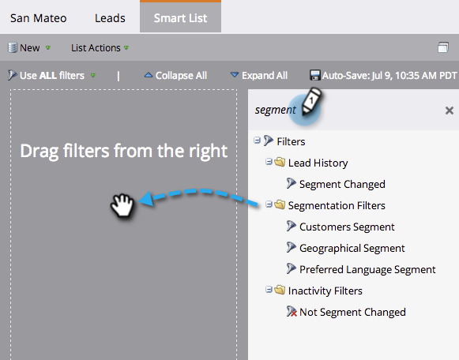

# 在智能列表{#use-segment-filters-in-a-smart-list}中使用区段过滤器

>[!PREREQUISITES]
>
>* [创建智能列表](/help/marketo/product-docs/core-marketo-concepts/smart-lists-and-static-lists/creating-a-smart-list/create-a-smart-list.md)
>* [创建分段](/help/marketo/product-docs/personalization/segmentation-and-snippets/segmentation/create-a-segmentation.md)

使用细分列表优化智能过滤器的性能。

1. 在您创建的智能列表中，搜索单词&#x200B;**区段**，拖放筛选器。

   

太棒了！ 现在您知道如何找到分段过滤器。
