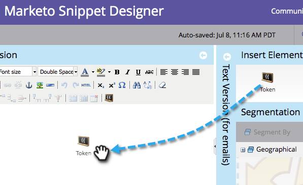

# 向代码段添加内容 {#add-content-to-a-snippet}

>[!PREREQUISITES]
>
>[创建代码片段](/help/marketo/product-docs/personalization/segmentation-and-snippets/snippets/create-a-snippet.md)

您可以将令牌、图像、文件或富文本添加到代码片段。

>[!NOTE]
>
>您不能在代码片段中嵌入任何[Marketo电子邮件语法](/help/marketo/product-docs/email-marketing/general/email-editor-2/email-template-syntax.md)；它将&#x200B;**在电子邮件中无效**。 代码片段应当只是正文内容(HTML + TEXT)。

1. 转到&#x200B;**[!UICONTROL Design Studio]**。

   

1. 选择您的&#x200B;**代码片段**&#x200B;并单击&#x200B;**[!UICONTROL Edit Draft]**。

   

您可以向代码片段中添加三种类型的内容。

## 添加[!UICONTROL Token] {#add-token}

1. 拖放&#x200B;**[!UICONTROL Token]**&#x200B;元素。

   

1. 输入&#x200B;**[!UICONTROL Token]**&#x200B;并单击&#x200B;**[!UICONTROL Insert]**。

   

## 添加图像/文件 {#add-image-file}

1. 拖放&#x200B;**[!UICONTROL Image/File]**&#x200B;元素。

   

   >[!NOTE]
   >
   >您可以将自己的图像或文件添加到Marketo。 了解有关[图像和文件](/help/marketo/product-docs/demand-generation/images-and-files/add-images-and-files-to-marketo.md)的详细信息。

1. 选择要使用的&#x200B;**图像**，然后单击&#x200B;**[!UICONTROL Insert]**。

   

   >[!NOTE]
   >
   >如果您知道特定图像的名称，也可以搜索该图像。

## 添加文本 {#add-text}

1. 在HTML版本区域中键入以添加文本。

   

   >[!TIP]
   >
   >使用格式设置工具自定义文本。

1. 对于电子邮件，请单击&#x200B;**[!UICONTROL Text Version (for emails)]**&#x200B;选项卡。

   

1. 单击 **[!UICONTROL Copy from HTML]**。

   

   >[!NOTE]
   >
   >删除了文本版本中的图像、链接和格式。

酷！ 现在，您可以为代码片段创建各种内容。

>[!MORELIKETHIS]
>
>* [预览代码片段](/help/marketo/product-docs/personalization/segmentation-and-snippets/snippets/preview-a-snippet.md)
>* [批准代码片段](/help/marketo/product-docs/personalization/segmentation-and-snippets/snippets/approve-a-snippet.md)
