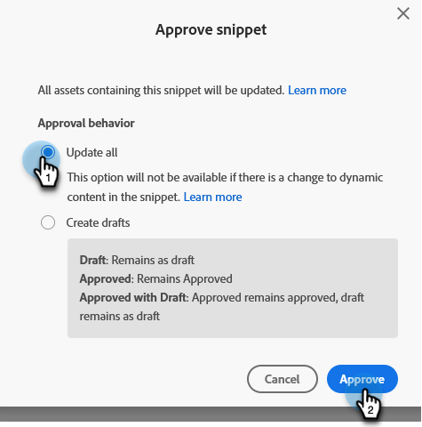

# 批准带有非草稿的代码片段 {#approve-a-snippet-with-no-draft}

## 批准代码片段 {#approve-the-snippet}

每次批准代码片段时，都会触发非草稿模式。 这包括其他工作区中的资产共享或引用的代码片段。

1. 转到 **[!UICONTROL Design Studio]**.

   

1. 查找并选择所需的代码片段。

   

1. 在 **[!UICONTROL 代码片段操作]** 下拉列表，选择 **[!UICONTROL 批准草稿]**.

   

1. 在批准代码片段对话框中选择一个选项，然后单击 **[!UICONTROL 批准]**：

   * **[!UICONTROL 全部更新]**：此选项不会使用代码片段创建已批准资产的草稿。 所有资产都会获得更新并保持其先前状态。 进度模块显示在屏幕的右上角；该模块可随时关闭。 要恢复该代码片段，请右键单击代码片段名称并选择显示审批状态。
   * **[!UICONTROL 创建草稿]**：此选项将使用代码片段创建已批准资产的草稿。 如果需要先审核代码片段更改，请选择此选项。 所有草稿都必须手动批准。

   

   >[!NOTE]
   >
   >对于尚未使用的新代码片段，不会显示批准草稿屏幕。 当在一个或多个资源中使用代码片段时，将显示该代码片段。

>[!CAUTION]
>
>此功能旨在通过代码片段审批工作流节省时间。 但是，有一些需要注意的限制。 请参阅 [本文](https://nation.marketo.com/t5/knowledgebase/no-draft-snippet-limitations-and-troubleshooting/ta-p/300799){target="_blank"} 以了解详细信息。

>[!MORELIKETHIS]
>
>[为代码片段启用无草稿](/help/marketo/product-docs/administration/users-and-roles/enable-no-draft-for-snippets.md){target="_blank"}
