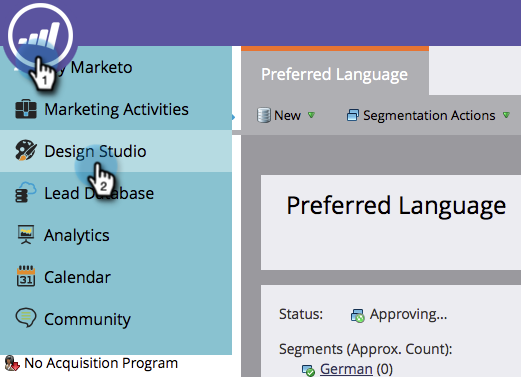
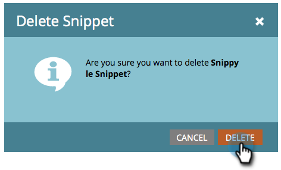

# 删除代码段 {#delete-a-snippet}

>[!PREREQUISITES]
>
>[取消批准代码片段](/help/marketo/product-docs/personalization/segmentation-and-snippets/snippets/unapprove-a-snippet.md)

删除您不再需要的代码片段。

1. 转到&#x200B;**[!UICONTROL Design Studio]**。

   

1. 转到您的代码片段，然后在&#x200B;**[!UICONTROL Snippet Actions]**&#x200B;下单击&#x200B;**[!UICONTROL Delete]**。

   

1. 单击&#x200B;**[!UICONTROL Delete]**&#x200B;进行确认或只单击&#x200B;**[!UICONTROL Cancel]**。

   

   >[!NOTE]
   >
   >您只能删除未批准且未被任何资产使用的代码片段。

完成！ 无法检索它，因此在单击“删除”按钮之前请务必加以确认。
