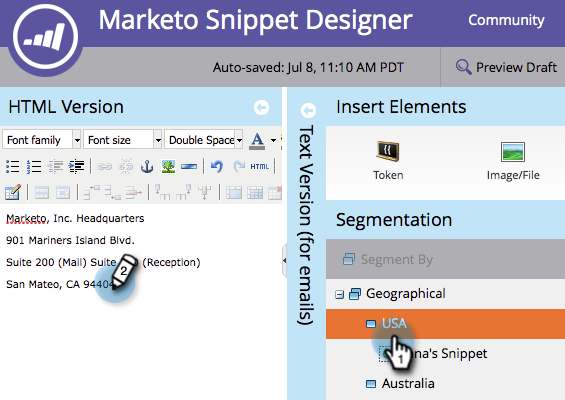

# 使用动态内容{#edit-snippets-with-dynamic-content}编辑片段

>[!PREREQUISITES]
>
>* [创建分段](/help/marketo/product-docs/personalization/segmentation-and-snippets/segmentation/create-a-segmentation.md)
>* [创建代码片断](/help/marketo/product-docs/personalization/segmentation-and-snippets/snippets/create-a-snippet.md)

使用代码片段中的分段功能轻松管理电子邮件和登陆页中的动态内容。

## 添加分段{#add-segmentation}

1. 转到&#x200B;**Design Studio**。

   

1. 单击&#x200B;**代码片断**，然后单击&#x200B;**编辑草稿**。

   

1. 单击&#x200B;**区段依据**。

   

1. 输入&#x200B;**分段**&#x200B;并单击&#x200B;**保存**。

   

## 应用动态内容{#apply-dynamic-content}

1. 单击&#x200B;**区段**，然后编辑内容。 对每个区段重复

   

>[!NOTE]
>
>在使用您的代码片断之前，请记住批准它。

不是那么简单吗？ 您现在都可以在电子邮件和登陆页中使用这些片段。

>[!MORELIKETHIS]
>
>* [向电子邮件中添加代码片断](/help/marketo/product-docs/email-marketing/general/functions-in-the-editor/add-a-snippet-to-an-email.md)
>* [向登陆页添加代码片断](/help/marketo/product-docs/demand-generation/landing-pages/personalizing-landing-pages/add-a-snippet-to-a-landing-page.md)

