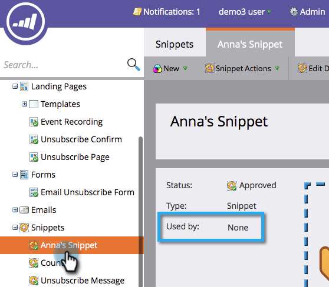

# 取消批准代码段 {#unapprove-a-snippet}

未批准的代码片段无法在电子邮件或登陆页面中使用。

1. 转到&#x200B;**[!UICONTROL Design Studio]**。

   

1. 转到您的代码片段，并确保它不是&#x200B;**[!UICONTROL Used by]**&#x200B;任何资源。

   

   如果您的代码片段被其他资产使用，请在继续操作之前删除这些关联。

1. 在&#x200B;**[!UICONTROL Snippet Actions]**&#x200B;中，单击&#x200B;**[!UICONTROL Unapprove]**。

   

您的代码片段现在处于草稿状态，可供您进行更改或删除。
