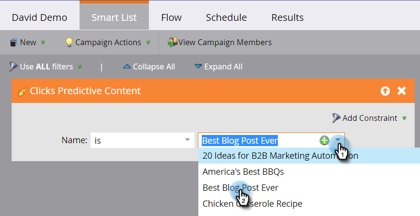

# 定义预测内容活动的智能列表 {#define-a-smart-list-for-predictive-content-activities}

在智能营销活动中定义智能列表时，您可以在触发器和过滤器中使用预测内容活动。 对于任何通过单击预测内容的人，您都可以触发 [富媒体模板](/help/marketo/product-docs/predictive-content/enabling-predictive-content/enable-predictive-content-for-web-rich-media.md)， [内容推荐栏](/help/marketo/product-docs/predictive-content/enabling-predictive-content/enable-the-content-recommendation-bar.md)，或在 [电子邮件](/help/marketo/product-docs/predictive-content/enabling-predictive-content/enable-predictive-content-in-emails.md).

1. 在智能营销活动中，导航到 **智能列表** 选项卡。

   

   >[!NOTE]
   >
   >智能列表可以做一些令人惊叹的事情。 在中了解详情 [智能列表深入挖掘](/help/marketo/product-docs/core-marketo-concepts/smart-campaigns/understanding-smart-campaigns.md).

1. 搜索触发器，然后将其拖放到画布上。

   

   >[!NOTE]
   >
   >具有触发器的智能营销活动在触发器模式下运行。 它根据触发的事件和添加的过滤器，每次只针对一个人运行。

1. 单击 **名称** 下拉列表并选择运算符。

   

1. 定义触发器。

   

1. 添加 **类型** 约束。

   

1. 选择智能列表所需的源。

   

1. 如果您将电子邮件源用于预测内容，请添加 **单击电子邮件中的链接** 触发器。 选择您的电子邮件并添加 **具有预测性** 约束，定义为 **true**.

   

1. 根据需要添加任何其他过滤器。

   

   >[!TIP]
   >
   >在同时具有触发器和过滤器的智能营销活动中，触发器位于顶部。 触发时，只有符合筛选条件的用户才会通过流。

   >[!NOTE]
   >
   >对于多个触发器，如果触发了任意一个触发器，则人员会通过流程进行处理。

   要同时对一组人员运行活动，请了解如何 [为批处理智能营销活动定义智能列表](/help/marketo/product-docs/core-marketo-concepts/smart-campaigns/creating-a-smart-campaign/define-smart-list-for-smart-campaign-batch.md).

   >[!MORELIKETHIS]
   >
   >* [为Smart Campaign定义智能列表 |批次](/help/marketo/product-docs/core-marketo-concepts/smart-campaigns/creating-a-smart-campaign/define-smart-list-for-smart-campaign-batch.md)
   >* [向智能营销活动添加流量步骤](/help/marketo/product-docs/core-marketo-concepts/smart-campaigns/flow-actions/add-a-flow-step-to-a-smart-campaign.md)
   >* [为Web个性化活动定义智能列表](/help/marketo/product-docs/web-personalization/working-with-web-campaigns/define-a-smart-list-for-web-personalization-activities.md)
   >* [为Web富媒体启用预测内容](/help/marketo/product-docs/predictive-content/enabling-predictive-content/enable-predictive-content-for-web-rich-media.md)
   >* [启用内容推荐栏](/help/marketo/product-docs/predictive-content/enabling-predictive-content/enable-the-content-recommendation-bar.md)
