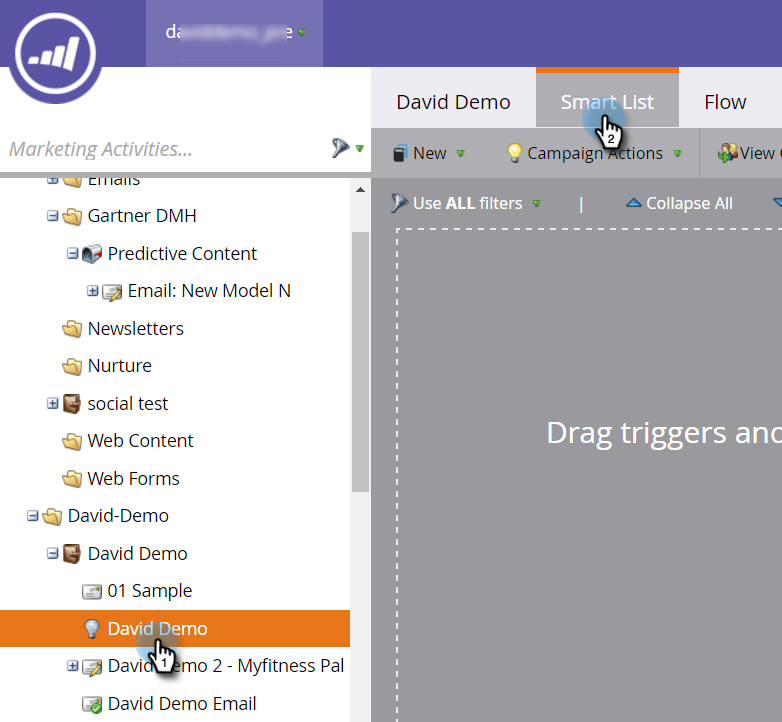

# 为预测性内容列表定义智能活动 {#define-a-smart-list-for-predictive-content-activities}

>[!NOTE]
>
>根据购买日期，您的营销订阅可能包括Marketo Predictive Content或Content`AI`。 对于使用预测内容的用户，Marketo在2018年4月`AI` 30日之前一直支持内容分析功能。 要使这些功能在该日期之后保持不变，请联系您的营销人员客户成功经理以升级到营销人员内容`AI`。

在智能活动中定义智能列表时，您可以在触发器和过滤器中使用预测内容活动。 您可以通过富媒体模板、内容推荐栏或电子 [邮件为单击](enabling-predictive-content/enable-predictive-content-for-web-rich-media.md)[预测性内容的任](enabling-predictive-content/enable-the-content-recommendation-bar.md)何人触发操作。

1. 在智能活动中，导航到智 **能列表** 选项卡。

   

   >[!NOTE]
   >
   >**深潜**
   >
   >
   >聪明的列表可以做令人惊叹的事情。 深入了解 [智能列表](../../product-docs/core-marketo-concepts/smart-campaigns/understanding-smart-campaigns.md)。

1. 搜索触发器，然后将其拖放到画布上。

   

   >[!NOTE]
   >
   >具有触发器的智能活动在触发器模式下运行。 它根据触发的事件和添加的过滤器，一次只运行一个人。

1. 单击“ **名称** ”下拉框并选择运算符。

   

1. 定义触发器。

   

1. 添加“类 **型** ”约束。

   

1. 选择您需要的智能列表源。

   

1. 如果您正在为预测性内容使用电子邮件源，请在电子邮件**触发器中添加**点击链接。 选择电子邮件并添加 **“是预测** ”约束(定义 **为true**)。

   

1. 根据需要添加任何其他过滤器。

   

   >[!TIP]
   >
   >在具有触发器和过滤器的智能活动中，触发器位于顶部。 触发时，只有满足筛选条件的人才能通过流。

   >[!NOTE]
   >
   >如果任何一个触发器被激活，用户就会通过多个触发器进入流程。

   [为批智能列表定义智能活动](../../product-docs/core-marketo-concepts/smart-campaigns/creating-a-smart-campaign/define-smart-list-for-smart-campaign-batch.md)

   >[!NOTE]
   >
   >**相关文章**
   >
   >    
   >    
   >    * [为智能列表定义智能活动 |批处理](../../product-docs/core-marketo-concepts/smart-campaigns/creating-a-smart-campaign/define-smart-list-for-smart-campaign-batch.md)
   >    * [向智能活动添加流步骤](../../product-docs/core-marketo-concepts/smart-campaigns/flow-actions/add-a-flow-step-to-a-smart-campaign.md)
   >    * [为Web个性化列表定义智能活动](../../product-docs/web-personalization/working-with-web-campaigns/define-a-smart-list-for-web-personalization-activities.md)
   >    * [为Web富媒体启用预测内容](enabling-predictive-content/enable-predictive-content-for-web-rich-media.md)
   >    * [启用内容推荐栏](enabling-predictive-content/enable-the-content-recommendation-bar.md)

要同时对一组人员运行活动，请学习如何。