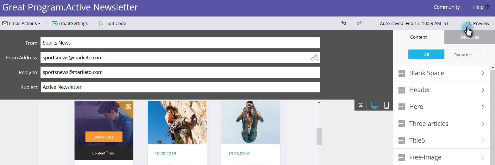

# 在电子邮件中启用预测内容 {#enable-predictive-content-in-emails}

在电子邮件预测中制作一个或多个图像，为每个收件人定制体验。

>[!NOTE]
>
>建议在测试和使用预测内容之前，您为每个类别和每个源（电子邮件、富媒体、条形图）启用五个以上的内容。 更多内容可让您更好地预测结果。

>[!PREREQUISITES]
>
>在启用预测内容之前，您必须：
>
>* **准备预测内容**
   >
   >   * [编辑电子邮件的预测内容](/help/marketo/product-docs/predictive-content/working-with-predictive-content/edit-predictive-content-for-emails.md){target=&quot;_blank&quot;}或
   >   * [编辑富媒体的预测内容](/help/marketo/product-docs/predictive-content/working-with-predictive-content/edit-predictive-content-for-rich-media.md){target=&quot;_blank&quot;}或
   >   * [编辑推荐栏的预测内容](/help/marketo/product-docs/predictive-content/working-with-predictive-content/edit-predictive-content-for-the-recommendation-bar.md){target=&quot;_blank&quot;}
>
>* [批准预测内容的标题](/help/marketo/product-docs/predictive-content/working-with-all-content/approve-a-title-for-predictive-content.md){target=&quot;_blank&quot;}


## 使用Email 2.0编辑器添加预测内容 {#adding-predictive-content-using-the-email-editor}

1. 单击 **营销活动**.

   

1. 选择您的电子邮件并单击 **编辑草稿**.

   

1. 单击要进行预测的图像。 出现齿轮图标时，单击该图标并选择 **启用ContentAI** （ContentAI是“预测内容”的前一个名称）。

   

1. 要选择一个或多个类别，请单击 **类别** 下拉框中，进行选择并单击 **应用**.

   

   >[!NOTE]
   >
   >选择特定类别或更改预测布局是可选的。

1. 您的图像现在可进行预测。 对其他图像重复步骤3和4（如果需要）。

   

1. 要预览电子邮件，请单击 **预览** 中。

   

1. 要查看不同的可能图像，请单击 **刷新**.

   

   >[!NOTE]
   >
   >未选择图像 **_直到收件人打开电子邮件_**. 因此，您在预览中看到的只是一个示例，不一定是收件人看到的图像。

1. 预览完电子邮件后，单击 **预览操作** 下拉框并选择 **批准并关闭**. 或者，如果您仍需要编辑，请单击 **编辑草稿** 在右边。

   

   >[!NOTE]
   >
   >发送样本时，将选择随机图像。

在您批准电子邮件后，该电子邮件将配备预测内容并可供发送！

>[!CAUTION]
>
>收件人打开电子邮件后，预测图像会被锁定。 如果稍后删除内容，收件人将看到内容所在的图像损坏。

## 不使用Email 2.0编辑器时添加预测内容 {#adding-predictive-content-when-not-using-the-email-editor}

如果您没有使用 [电子邮件2.0](/help/marketo/product-docs/email-marketing/general/email-editor-2/email-editor-v2-0-overview.md){target=&quot;_blank&quot;}模板，只需将模板中的图像标记为Marketo可编辑的图像元素，即可将预测内容添加到电子邮件中。

了解 [此处的Marketo特定语法](/help/marketo/product-docs/email-marketing/general/email-editor-2/email-template-syntax.md#elements){target=&quot;_blank&quot;}。

以下是代码外观的示例（这只是一个示例，请勿精确复制下面的代码）。

**示例**

```example
<div class="mktoImg" id="exampleImg" mktoName="Example Image" mktoImgLink="https://www.marketo.com">  
<a></a>  
</div>
```
