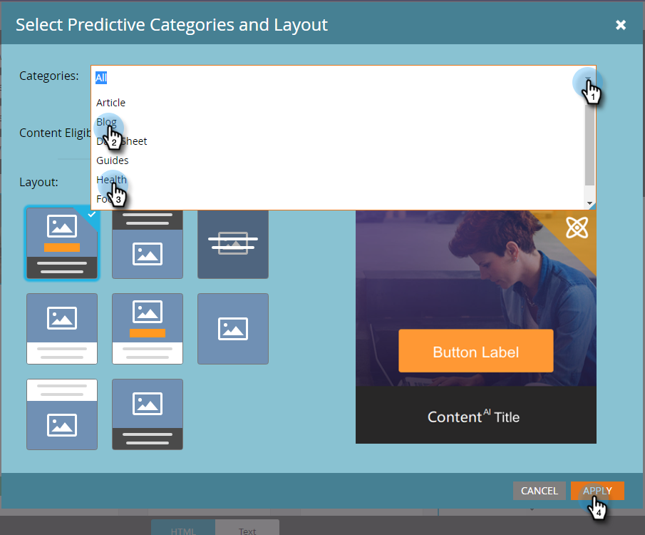

# 在电子邮件{#enable-predictive-content-in-emails}中启用预测内容

在电子邮件预测中制作一个或多个图像，为每个收件人定制体验。

>[!NOTE]
>
>建议您在测试和使用预测内容之前，针对每个类别和每个源（电子邮件、富媒体、栏）启用五种以上的内容。 内容越多，预测效果越好。

>[!PREREQUISITES]
>
>在启用预测内容之前。 您必须：
>
>* [准备预测内容](/help/marketo/product-docs/predictive-content/working-with-predictive-content/edit-predictive-content-for-emails.md)
>* [批准预测内容的标题](/help/marketo/product-docs/predictive-content/working-with-all-content/approve-a-title-for-predictive-content.md)


## 使用Email 2.0编辑器{#adding-predictive-content-using-the-email-editor}添加预测内容

1. 单击&#x200B;**营销活动**。

   

1. 选择您的电子邮件，然后单击&#x200B;**编辑草稿**。

   

1. 单击要进行预测的图像。 出现齿轮图标时，单击它并选择&#x200B;**启用内容`AI`**（Content`AI`是“预测内容”的前一个名称）。

   

1. 要选择一个或多个类别，请单击&#x200B;**类别**&#x200B;下拉框，进行选择，然后单击&#x200B;**应用**。

   

   >[!NOTE]
   >
   >选择特定类别或更改预测布局是可选的。

1. 您的图像现在具有预测性。 对其他图像重复步骤3和4（如果需要）。

   

1. 要预览电子邮件，请单击右上角的&#x200B;**预览**。

   

1. 要视图不同的可能图像，请单击&#x200B;**刷新**。

   

   >[!NOTE]
   >
   >在收件人打开电子邮件&#x200B;_**之前，不会选择**_&#x200B;图像。 所以，你在预览中看到的只是一个例子，它不一定是收件人看到的图像。

1. 预览完电子邮件后，单击&#x200B;**预览操作**&#x200B;下拉框，然后选择&#x200B;**批准并关闭**。 或者，如果仍需要编辑，请单击右侧的&#x200B;**编辑草稿**。

   

   >[!NOTE]
   >
   >发送样本时，将选择随机图像。

在您批准您的电子邮件后，该电子邮件将配备预测内容并准备发送！

>[!CAUTION]
>
>收件人打开电子邮件后，预测图像即被锁定。 如果稍后删除内容，收件人将看到内容所在的损坏图像。

## 在不使用Email 2.0编辑器{#adding-predictive-content-when-not-using-the-email-editor}时添加预测内容

如果您没有使用[Email 2.0](/help/marketo/product-docs/email-marketing/general/email-editor-2/email-editor-v2-0-overview.md)模板，则只需将模板中的图像标记为Marketo可编辑的图像元素，即可向电子邮件中添加预测内容。

在此处了解[特定于Marketo的语法](/help/marketo/product-docs/email-marketing/general/email-editor-2/email-template-syntax.md#elements)。

以下是代码的外观示例（这只是示例，不要完全复制下面的代码）。

**示例**

```example
<div class="mktoImg" id="exampleImg" mktoName="Example Image" mktoImgLink="https://www.marketo.com">  
<a></a>  
</div>
```
