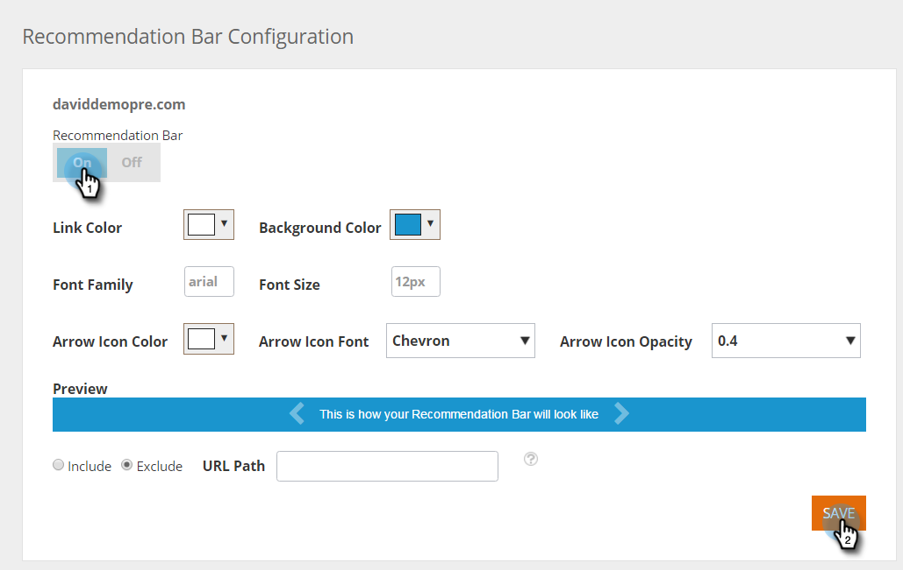

# 启用内容推荐栏 {#enable-the-content-recommendation-bar}

内容推荐引擎使用预测分析和机器学习算法，向每个Web访客提供相关内容。 推荐引擎可预测哪些内容对每位访客的效果最佳。 引擎的内容在Recommendations页面下受监视和控制，可帮助您优化内容ROI。

>[!PREREQUISITES]
>
>在启用预测内容之前，您必须：
>
>* **准备预测内容**
>
>   * [编辑电子邮件的预测内容](/help/marketo/product-docs/predictive-content/working-with-predictive-content/edit-predictive-content-for-emails.md) 或
>   * [编辑富媒体的预测内容](/help/marketo/product-docs/predictive-content/working-with-predictive-content/edit-predictive-content-for-rich-media.md) 或
>   * [编辑推荐栏的预测内容](/help/marketo/product-docs/predictive-content/working-with-predictive-content/edit-predictive-content-for-the-recommendation-bar.md)
>
>* [批准预测内容的标题](/help/marketo/product-docs/predictive-content/working-with-all-content/approve-a-title-for-predictive-content.md)

## 启用和自定义内容推荐栏 {#enable-and-customize-the-content-recommendation-bar}

1. 转到 **内容设置**.

   

1. 单击 **条形图**.

   

1. 要为URL启用推荐栏，只需单击 **日期** 然后 **保存**.

   

1. 要自定义URL，请选择推荐栏的颜色、样式、格式、箭头以及要包含或排除该栏的页面。 根据您的网站品牌进行自定义。 单击 **保存**.

   

   >[!NOTE]
   >
   >**包含/排除显示URL**
   >
   >* 显示URL应为域的路径
   >* 不包括https://或https://
   >* 使用 &#42; 用于通配符
   >* 使用分号作为分隔符
   >* 示例： /contact_us&#42;； &#42;action=logout&#42;
   >* 此字段区分大小写

## 推荐栏注意事项 {#recommendation-bar-considerations}

* 要将推荐栏设置为，您至少需要一个内容块 **日期** Recommendations ，推荐引擎才能正常工作。 如果未启用任何内容，并且条形图设置为 **日期**，则箭头效果将显示在网页的右下角，但不会显示推荐的内容。

* 推荐引擎中运行的内容越多，算法就越能测试和了解哪些内容最有效。 我们建议从10到20个正在运行和处于活动状态的内容片段开始，并继续添加新内容片段。
* 您为推荐启用的内容块应包含RTP Javascript标记。 这有助于算法跟踪和优化推荐内容。

>[!MORELIKETHIS]
>
>[为Web富媒体启用预测内容](/help/marketo/product-docs/predictive-content/enabling-predictive-content/enable-predictive-content-for-web-rich-media.md)
