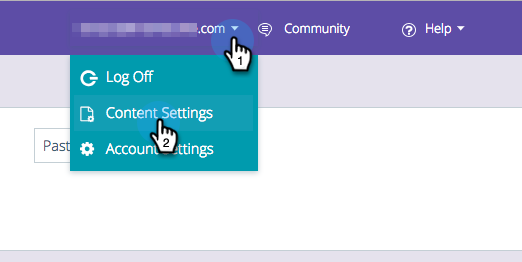
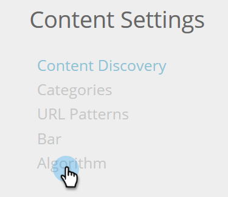

# 算法目标设置 {#algorithm-goal-settings}

算法目标设置允许您设置预测内容人工智能算法的最终目标，以符合您的业务目标。

1. 在预测内容中，单击您的登录名并选择&#x200B;**[!UICONTROL Content Settings]**。

   

1. 在内容设置下，选择&#x200B;**[!UICONTROL Algorithm]**。

   

1. 为AI算法的每个预测内容源选择一个目标，以最大限度地提高内容性能。

   

   | **[!UICONTROL Clicks]** | 显示最可能让查看内容的人点击的内容 |
   |---|---|
   | **[!UICONTROL Conversions]** | 显示最有可能使查看内容的人员提交表单的内容 |

1. 完成后，单击 **[!UICONTROL Save]**。

   
