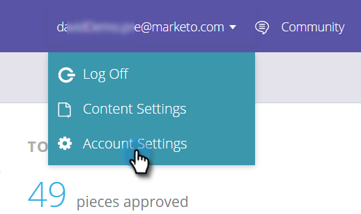

# 部署用于Content-AI的JavaScript {#deploy-the-javascript-for-content-ai}

要使用预测内容，您需要生成并设置RTP（Web个性化）标记。

## 生成标记 {#generate-tag}

1. 登录到您的预测内容帐户。 转到 **帐户设置**.

   

1. 在 **域配置**，找到相关域并单击 **生成标记**.

   

1. 将Web个性化标记复制并粘贴到您网站的HTML中。

   

   >[!NOTE]
   >
   >复制Web个性化JavaScript标记并将其作为第一个脚本粘贴到页面标题中的 `<head> </head>` 标记。 查看更详细的 [实施说明，请参阅此处](/help/marketo/product-docs/web-personalization/rtp-tag-implementation/deploy-the-rtp-javascript.md).

1. 验证标记是否显示在所有页面上，包括登陆页面和子域。 右键单击您网站的页面以查看此代码。 转到 **查看页面源** 在Web浏览器中。 搜索：“RTP”。

1. 确认标记切换开关设置为 **开**.
