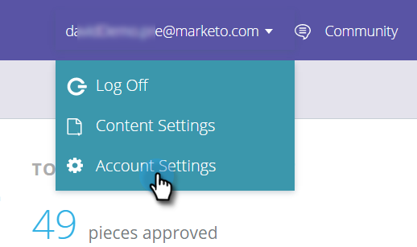

# 部署 Content-AI 的 JavaScript {#deploy-the-javascript-for-content-ai}

要使用预测内容，您需要生成和设置RTP (Web Personalization)标记。

## 生成标记 {#generate-tag}

1. 登录您的Predictive Content帐户。 前往 **[!UICONTROL Account Settings]**。

   

1. 在&#x200B;**[!UICONTROL Domain Configuration]**&#x200B;中，找到相关域并单击&#x200B;**[!UICONTROL Generate Tag]**。

   

1. 将Web Personalization标记复制并粘贴到网站的HTML中。

   

   >[!NOTE]
   >
   >复制Web Personalization JavaScript标记，并将其作为第一个脚本粘贴到页眉的`<head> </head>`标记之间。 请在此处查看更详细的[实施说明](/help/marketo/product-docs/web-personalization/rtp-tag-implementation/deploy-the-rtp-javascript.md)。

1. 验证标记是否出现在所有页面上，包括登陆页面和子域。 可通过右键单击您网站的页面来检查此项。 在Web浏览器中转到&#x200B;**[!UICONTROL View Page Source]**。 搜索：“RTP”。

1. 确认标记切换设置为&#x200B;**[!UICONTROL ON]**。
