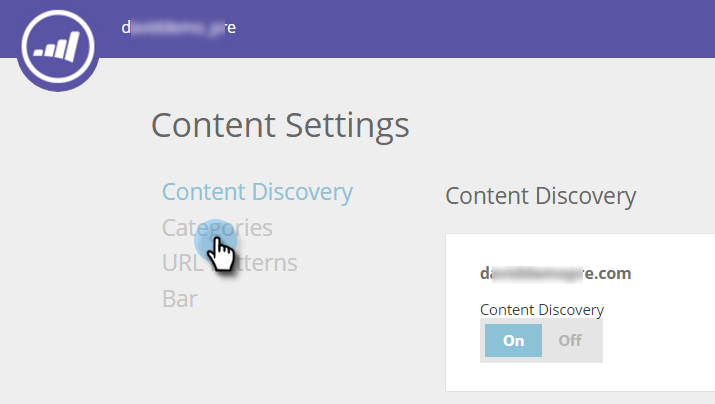
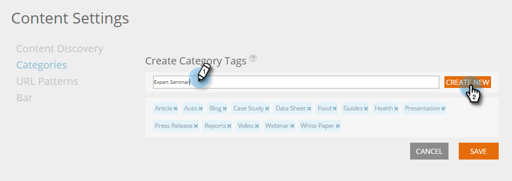

# 设置类别 {#set-up-categories}

在预测内容中创建类别，以将您的预测结果分组到Web或电子邮件中。 例如，您只能使用博客，或使用特定语言的内容。 它还允许您搜索和筛选页面查看。  类别显示在[!UICONTROL All Content]和[!UICONTROL Predictive Content]页面上以便于参考。

编辑搜索到的内容时，在编辑屏幕中添加类别。 单击&#x200B;**[!UICONTROL Categories]**&#x200B;字段并从下拉菜单中选择它们。

添加内容时，可以使用弹出窗口中选择的类别标记内容。

## 创建类别标记 {#create-category-tags}

以下是如何创建类别标记。

1. 前往 **[!UICONTROL Content Settings]**。

   

1. 单击 **[!UICONTROL Categories]**。

   

1. 将显示现有类别标记。 输入新的类别标记并单击&#x200B;**[!UICONTROL Create New]**。

   

1. 您可以通过单击类别标记旁边的&#x200B;**x**&#x200B;来删除该类别标记。

   

1. 完成后，单击&#x200B;**[!UICONTROL Save]**。

   

   很简单。
