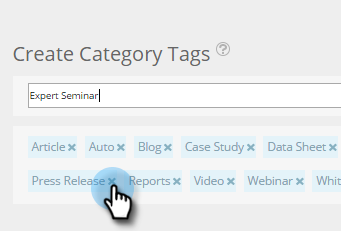

# 设置类别 {#set-up-categories}

在预测内容中创建类别，以将您的预测结果分组到Web或电子邮件中。 例如，您只能使用博客，或使用特定语言的内容。 它还允许您搜索和筛选页面查看。  类别将显示在所有内容和预测内容页面上，以供轻松参考。

编辑搜索到的内容时，在编辑屏幕中添加类别。 单击 **类别** 字段并从下拉列表中选择它们。

添加内容时，可以使用弹出窗口中选择的类别标记内容。

## 创建类别标记 {#create-category-tags}

以下是如何创建类别标记。

1. 转到 **内容设置**.

   

1. 单击 **类别**.

   

1. 将显示现有类别标记。 输入新的类别标记并单击 **新建**.

   

1. 您可以通过单击 **x** 旁边的。

   

1. 单击 **保存** 等你完事了。

   

   很简单。
