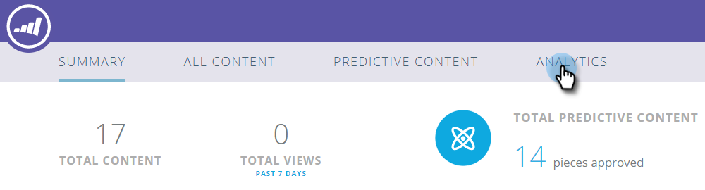
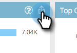

# 预测内容分析概述{#predictive-content-analytics-overview}

使用内容分析进一步洞察您的现有内容，了解（基于AI和预测算法）哪些内容对您的受众有效，并从营销工作中提高ROI。

>[!NOTE]
>
>“分析”选项卡和内容分析功能仅在Marketo Predictive Content中提供。

## 概述{#overview}

在“摘要”页面上，单击&#x200B;**Analytics**。

分析包括以下几个部分：按视图排名的热门内容、按转化率排名的热门内容、趋势内容、建议内容和内容。

有关其他详细信息，请将鼠标悬停在任何章节标题中的问号上。

单击“导出”按钮，通过Excel导出该部分的结果。

您可以按各种属性/属性(例如ABM帐户列表、国家等)筛选结果。

单击日历图标以更改反射数据的日期。 选择预设的时间量或特定的日期范围。

## 按视图{#top-content-by-views}排列的热门内容

按每个选定日期范围的视图数显示顶级内容片段。

## 按转化率{#top-content-by-conversion-rate}排列的热门内容

按转化率显示所选日期范围的顶级转换内容。

>[!NOTE]
>
>**定义**
>
>**转化率**:由直接转换除以点击量计算的百分比。

## 趋势内容{#trending-content}

通过观察与前一时段相比，过去两周的视图量增加，显示内容文章的受欢迎程度飙升。

## 建议内容{#suggested-content}

显示我们建议您根据您定义的过滤器在营销活动中促销的内容。

将鼠标悬停在建议内容中的图像上可显示可用选项。

>[!NOTE]
>
>看到底部的图标了吗？ 从左至右为：视图内容、导出到CSV、批准内容。

## 内容{#content}

搜索所需的内容片段并单击它以查看其他详细信息，包括：查看内容的访客，新的还是回访的，已知的和匿名的，访客查看内容时所处的位置，以及他们来自的推断行业。

>[!NOTE]
>
>相似内容基于所选内容片段，并由关联规则算法计算。 结果表示访客最可能单击的内容片段，具体取决于所选片段和过去的访客行为。 它不考虑过滤器或日期范围。
