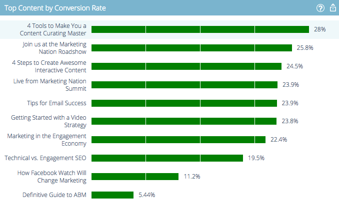

# 预测内容分析概述 {#predictive-content-analytics-overview}

使用内容分析深入了解您的现有内容，了解（基于AI和预测算法）哪些内容对受众有效，并提高营销工作的ROI。

>[!NOTE]
>
>Analytics选项卡和内容分析功能仅在Marketo预测内容中提供。

## 概述 {#overview}

在“摘要”页面上，单击 **Analytics**.

Analytics包括以下几个部分：按查看排名最前的内容、按转化率排名最前的内容、趋势内容、建议内容和内容。

将鼠标悬停在任何部分标题中的问号上，可获取更多详细信息。

单击导出按钮以通过Excel导出该部分的结果。

您可以按各种属性/属性（例如ABM帐户列表、国家/地区等）过滤结果。

单击日历图标可更改反映数据的日期。 选择预设的时间量或特定的日期范围。

## 按视图划分的热门内容 {#top-content-by-views}

按选定日期范围内的查看次数显示排名最前的内容片段。

## 按转化率划分的热门内容 {#top-content-by-conversion-rate}

按选定日期范围的转化率显示排名最前的转化内容。

>[!NOTE]
>
>**条件**
>
>**转化率**:由直接转化除以点击量计算的百分比。

## 趋势内容 {#trending-content}

通过查看与上一时段相比，过去两周的查看次数增加，可显示内容片段的受欢迎程度激增。

## 建议内容 {#suggested-content}

根据您定义的过滤器显示我们建议您在营销活动中促销的内容。

将鼠标悬停在建议内容中的图像上可显示可用选项。

>[!NOTE]
>
>看到底部的图标了吗？ 从左到右为：查看内容、导出到CSV、批准内容。

## 内容 {#content}

搜索所需的内容片段并单击它可查看其他详细信息，包括：查看该内容的访客，包括新访客与回访访客、已知访客和匿名访客，查看内容时来自的最佳位置，以及他们来自的最热门的推断性行业。

>[!NOTE]
>
>相似内容基于选定的内容片段，并由关联规则算法计算。 结果表示访客最可能点击的内容片段，具体取决于所选内容片段和过去访客的行为。 它不考虑过滤器或日期范围。
