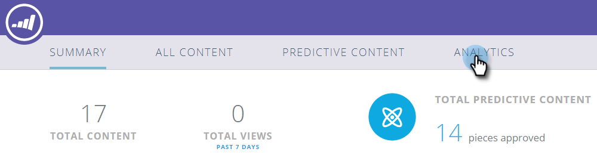

# 预测性内容摘要 {#the-predictive-content-summary}

“预测内容概要”以表格、图形和当前数字的形式显示您需要的有关预测内容的信息。

## 顶部栏 {#top-bar}

顶部栏显示内容和视图的当前数字以及启用的段数。 在右上角选择过去7天或30天的整个页面视图。

## 性能表 {#performance-table}

您可以在此处查看发现的前10项内容，包括查看次数、直接商机和转化率。

## [!UICONTROL Predictive Engagement] {#predictive-engagement}

通过比较总点击量和直接商机以及比较不同来源的表现，了解您的转化率。

## [!UICONTROL Content Trend by Views]  {#content-trend-by-views}

比较所有内容的视图如何与预测内容相匹配。

## [!UICONTROL Top Categories by Engagement] {#top-categories-by-engagement}

哪些类别的内容最吸引人？ 请参阅此图表中的内容。

>[!NOTE]
>
>如果单击某个类别链接（上图中的示例：leadgen、email等），则会打开“所有内容”页面，其中您单击的类别已添加到过滤器中，并显示该类别中的内容分析。
