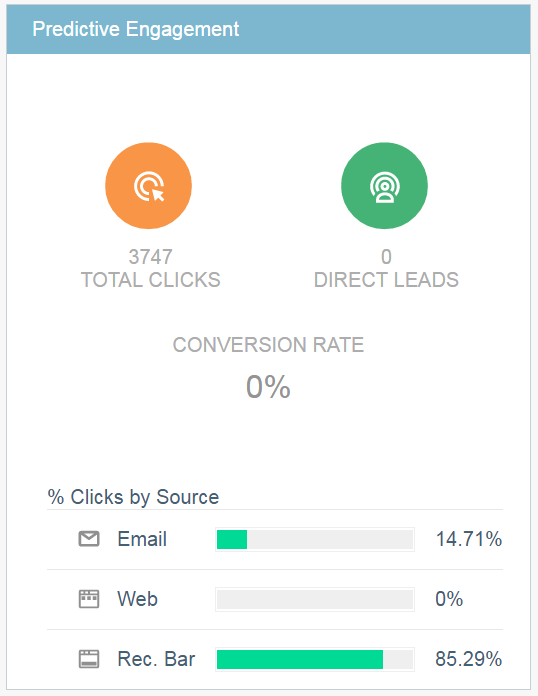

# 预测内容摘要{#the-predictive-content-summary}

“预测内容摘要”一览表、图表和当前数字显示您需要的有关预测内容的信息。

## 顶栏{#top-bar}

顶栏显示内容和视图的当前数字以及启用的片段数。 为右上角的整个页面选择过去7或30天的视图。

## 性能表{#performance-table}

您可以在此处查看您发现的前10条内容，包括视图、直接潜在客户和转化率。

## 预测参与{#predictive-engagement}

通过比较总点击量和直接销售线索，并比较不同来源的性能，了解您的转化率。

## 按视图{#content-trend-by-views}列出的内容趋势

比较所有内容的视图与预测内容的匹配方式。

## 按参与度列出的热门类别{#top-categories-by-engagement}

哪类别内容最具吸引力？ 在这个图表中看到它。

>[!NOTE]
>
>如果单击类别链接(上图中的示例：leadgen、email等。) 它打开“所有内容”页面，并将您单击的类别添加到筛选器，显示该类别中的内容分析。
