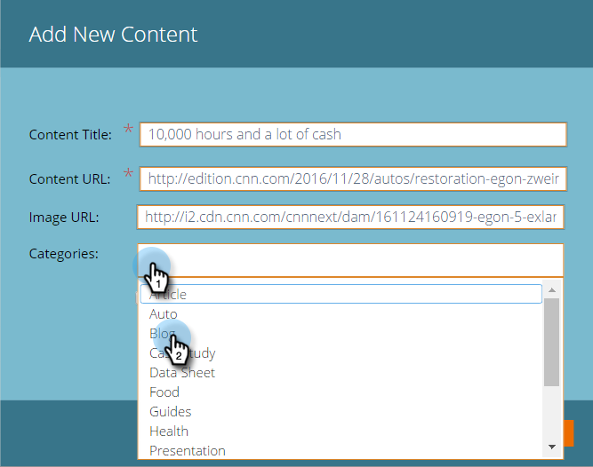

# 添加新内容{#add-new-content}

>[!NOTE]
>
>根据购买日期，您的营销订阅可能包括Marketo Predictive Content或Content`AI`。 对于使用预测内容的用户，Marketo在2018年4月30日之前将启用“内容`AI`分析”功能。 要使这些功能在该日期之后保持不变，请联系您的Marketo Customer Success Manager以升级到Marketo Content`AI`。

您可以轻松地将内容手动添加到“所有内容”页面。

1. 单击&#x200B;**添加内容**&#x200B;下拉框并选择&#x200B;**添加内容**。

   

1. 输入标题和URL，以及图像URL（如果需要）。

   

1. 要添加类别，请单击该字段并从下拉列表中选择。

   

1. 单击&#x200B;**添加**。

   

1. 新标题现在显示在&#x200B;**所有内容**&#x200B;页面上。 请注意，它尚未获得预测内容批准。

   

1. 下面介绍如何将其添加到[预测内容](http://docs.marketo.com/x/Vbet)。

